# JOMBOY LAVKA UZBEKISTAN — ТЕХНИЧЕСКОЕ ЗАДАНИЕ v1.0

| Параметр | Значение |
|----------|----------|
| Версия | 1.0 |
| Дата | 27 июня 2026 |
| Статус | Утверждение |
| Рынок | Узбекистан (Ташкент → Самарканд → областные центры) |
| Языки | Узбекский (кириллица), Узбекский (латиница), Русский, Английский |
| Валюта | UZS (сум) |
| Курс для расчётов | 1 USD ≈ 12 500 UZS |
| Целевое время доставки | 15 минут (центр Ташкента), до 25 минут (окраины) |

---

## Оглавление

1. [Продуктовая часть](#1-продуктовая-часть)
2. [Приложения (7 интерфейсов)](#2-приложения-7-интерфейсов)
3. [Backend-архитектура](#3-backend-архитектура)
4. [Инфраструктура](#4-инфраструктура)
5. [Интеграции](#5-интеграции)
6. [Дорожная карта (14 месяцев)](#6-дорожная-карта-14-месяцев)
7. [Команда и бюджет](#7-команда-и-бюджет)
8. [Чек-лист приёмки MVP](#8-чек-лист-приёмки-mvp)

---

## 1. Продуктовая часть

### 1.1. Позиционирование и целевая аудитория

#### 1.1.1. Позиционирование

**Jomboy Lavka** — сервис экспресс-доставки продуктов и товаров повседневного спроса из даркстора (dark store) за 15–25 минут. Позиционируется как аналог Яндекс Лавки, адаптированный под рынок Узбекистана.

**Ключевые отличия от конкурентов:**

| Параметр | Jomboy Lavka | Uzum Tezkor | Korzinka Go | Локальные мини-маркеты |
|----------|--------------|-------------|-------------|------------------------|
| Время доставки (центр) | 15 мин | 30–45 мин | 60+ мин | 0 (самовывоз) |
| Ассортимент | 3 900 SKU (старт) | Широкий, рестораны | Супермаркет | Ограниченный |
| Оплата | Только онлайн | Онлайн + COD | Онлайн + COD | Наличные |
| Языки | 4 (uz кирилл./лат., ru, en) | 2–3 | 2 | 1–2 |
| Халяль | Сертификация, фильтр | Частично | Есть | Не маркировано |
| Дизайн приложения | Минималистичный, зелёный | Перегруженный | Устаревший | Нет приложения |

**Слоган:** «Лавка за 15 минут — свежо, халяль, без очередей».

**География запуска:** Ташкент, зона покрытия первого даркстора — радиус 3 км (центр: Мирабад, Юнусабад, Чиланзар). Расширение на окраины — до 5 км с надбавкой за доставку.

#### 1.1.2. Целевая аудитория

**Сегмент 1: Urban Young Family (40% аудитории)**

- Возраст: 25–40 лет
- Локация: махалли в спальных районах Ташкента
- JTBD: «Быстро докупить продукты к ужину, не выходя из дома, с гарантией халяль»
- Средний чек: 100 000–150 000 UZS (8–12 USD)
- Частота: 3–4 заказа в неделю
- Каналы привлечения: Instagram, Telegram, сарафанное радио в махалле

**Сегмент 2: Office Worker (35% аудитории)**

- Возраст: 18–35 лет
- Локация: бизнес-центры, коворкинги
- JTBD: «Заказать обед, перекус или продукты после работы за 15 минут»
- Средний чек: 60 000–90 000 UZS (4.8–7.2 USD)
- Частота: 2–3 заказа в неделю (пик: 12:00–14:00, 18:00–20:00)
- Каналы: таргет в LinkedIn/Telegram, корпоративные промокоды (фаза 3)

**Сегмент 3: Expat / English-speaking (15–20% аудитории)**

- Возраст: 25–45 лет
- Локация: центр Ташкента, дипломатический квартал
- JTBD: «Найти привычные продукты и интерфейс на английском с быстрой доставкой»
- Средний чек: 120 000–180 000 UZS (9.6–14.4 USD)
- Частота: 1–2 заказа в неделю
- Каналы: expat-сообщества, Google Ads на английском

**Сегмент 4: Пожилые пользователи (5–10%, фаза 2+)**

- Возраст: 55+
- JTBD: «Заказать продукты с помощью родственников или голосового поиска»
- Особенности: крупный шрифт, упрощённый UI, поддержка кириллического узбекского

#### 1.1.4. Конкурентный ландшафт и рыночная возможность

Рынок быстрой доставки продуктов в Ташкенте находится на стадии активного роста. По оценкам команды, объём рынка e-grocery в Узбекистане в 2026 году составляет ~150–200 млн USD с CAGR 25–30%. При этом сегмент ultra-fast delivery (менее 20 минут) практически не занят: существующие игроки фокусируются на широком ассортименте и слотах 1–2 часа.

**Барьеры входа, которые Jomboy Lavka преодолевает:**

1. **Операционная экспертиза dark store** — волновая сборка, зонирование, SLA на каждый этап
2. **Локализация** — 4 языка, махалли, халяль, отсутствие алкоголя как осознанный выбор
3. **Технологический стек** — микросервисы, offline-first для полевого персонала, data residency
4. **Unit-экономика** — фокус на contribution margin с первого дня, без субсидирования COD

**Риски:**

| Риск | Вероятность | Митигация |
|------|-------------|-----------|
| Выход крупного игрока (Uzum, Яндекс) | Средняя | Скорость, нишевый UX, локальная экспертиза |
| Рост аренды даркстора | Высокая | Долгосрочный договор, второй даркстор на окраине (дешевле) |
| Сбои Payme/Click | Средняя | Dual acquirer, circuit breaker |
| Кадровый дефицит курьеров | Высокая | Конкурентная оплата, surge pricing (фаза 3) |
| Жара +45°C (июль–август) | Высокая | Термосумки, сокращение ассортимента заморозки в пик жары |

#### 1.1.5. Зона покрытия первого даркстора (Ташкент)

| Зона | Радиус | Время доставки | Надбавка | Примечание |
|------|--------|----------------|----------|------------|
| Центр | 0–2 км | 15 мин | 0 | Мирабад, часть Юнусабада |
| Средняя | 2–3 км | 18–20 мин | 0 | Чиланзар, Сергели (часть) |
| Окраина | 3–5 км | 22–25 мин | +500 UZS/км | Сложные махалли +3 000 UZS |

Площадь даркстора: ~200 м², высота потолков 3.5 м, отдельные камеры: охлаждение (+2…+6°C), заморозка (−18°C), сухой склад (комнатная t°).

#### 1.1.3. Value Proposition

1. **Скорость:** 15 минут в центре — измеримое конкурентное преимущество
2. **Халяль:** сертифицированное мясо и молочка, фильтр в каталоге
3. **Локализация:** 4 языка, учёт махаллей, ориентиров вместо точных адресов
4. **Безналичность:** только онлайн-оплата — снижение фрода и ускорение доставки
5. **Дизайн:** современный минималистичный интерфейс без перегруза

---

### 1.2. Ассортиментная матрица

#### 1.2.1. Категории и SKU на старте

| Категория | SKU (старт) | Доля | Подкатегории (уровень 2) |
|-----------|-------------|------|--------------------------|
| Свежие продукты | 800 | 20.5% | Овощи (200), фрукты (150), мясо халяль (150), птица (100), молочка (120), яйца (30), зелень (50) |
| Бакалея | 1 200 | 30.8% | Крупы (200), макароны (150), консервы (200), соусы/приправы (250), масла (100), мука/сахар (150), детское питание (150) |
| Напитки | 400 | 10.3% | Вода (80), соки (100), газировка (80), чай (70), кофе (70) |
| Сладости и снеки | 600 | 15.4% | Конфеты (150), печенье/выпечка (120), чипсы (100), орехи/сухофрукты (130), шоколад (100) |
| Заморозка | 300 | 7.7% | Пельмени/вареники (80), мороженое (70), полуфабрикаты (80), овощи заморож. (70) |
| Бытовая химия | 400 | 10.3% | Моющие средства (120), стирка (80), бумага/салфетки (100), гигиена (100) |
| Хлебобулочные | 200 | 5.1% | Хлеб свежий (80), лепёшки (50), булочки/круассаны (70) |
| **ИТОГО** | **~3 900** | **100%** | Цель к году 2: 10 000 SKU |

**Ограничения ассортимента:**

- Алкоголь — **исключён** полностью (нет категории, нет SKU, фильтр на уровне поставщиков)
- Табак — исключён
- Мясо и молочка — только с халяль-сертификатом (поле `halal_certified: true` в каталоге)
- Лекарства — исключены (требуют отдельной лицензии)

#### 1.2.2. Зонирование склада (волновая сборка)

| Зона | Категории | Температура | Сертификация сборщика |
|------|-----------|-------------|----------------------|
| A | Свежие продукты (овощи, фрукты, мясо, молочка) | +2…+6°C | Базовая + санитарная |
| B | Бакалея, сладости | Комнатная | Базовая |
| C | Заморозка | −18°C | Морозильная зона (отдельный допуск) |
| D | Бытовая химия | Комнатная | Базовая |
| E | Напитки | +2…+25°C | Базовая |
| F | Хлебобулочные | Комнатная | Базовая (приоритет — последняя зона) |

Зона F собирается последней, чтобы хлеб оставался свежим. Заморозка (C) упаковывается в термосумку с хладоэлементами.

#### 1.2.3. Политика маркировки и compliance

- **АСЛ БЕЛГИ** (маркировка товаров): полная интеграция — фаза 2; на MVP — ручная верификация при приёмке
- **Халяль:** скан сертификата поставщика при онбординге SKU, отображение badge в приложении
- **Срок годности:** для зоны A — минимум 3 дня до истечения при выкладке; система алертов за 24 часа

#### 1.2.4. Детализация подкатегорий (уровень 2)

**Свежие продукты (800 SKU):**

| Подкатегория | SKU | Средняя цена (UZS) | Особенности |
|--------------|-----|-------------------|-------------|
| Овощи | 200 | 8 000 | Весовые, сезонность, поставка ежедневно |
| Фрукты | 150 | 15 000 | Импорт + локальные, весовые |
| Мясо халяль | 150 | 85 000/кг | Сертификат, охлаждённое, зона A |
| Птица | 100 | 45 000/кг | Халяль, охлаждённое |
| Молочка | 120 | 12 000 | Срок годности 5–14 дней |
| Яйца | 30 | 18 000 | Упаковки 10/15/30 шт. |
| Зелень | 50 | 5 000 | Поставка 2 раза в день |

**Бакалея (1 200 SKU):** топ-50 SKU дают 40% выручки категории (масло, рис, макароны, сахар, соль). Стратегия: широкий хвост для «полной корзины».

**Заморозка (300 SKU):** летом (июнь–август) сокращение выкладки на 20% из-за жары; приоритет доставки заморозки в первые 10 минут после сборки.

#### 1.2.5. Политика ценообразования

| Принцип | Описание |
|---------|----------|
| Конкурентное паритет | Мониторинг цен Korzinka, Makro 2 раза в неделю |
| Наценка | 25–35% на бакалею, 15–25% на свежие (выше spoilage risk) |
| Психологические цены | Окончания 900, 990 (например, 12 900 сум) |
| Динамика | HQ может менять цены через Admin API; propagation < 60 сек в Catalog |
| Промо (фаза 3) | Скидки от поставщиков, не ниже себестоимости без approval |

---

### 1.3. Бизнес-модель и unit-экономика

#### 1.3.1. Модель монетизации

1. **Наценка на товарах** — основной источник выручки (валовая маржа ~30%)
2. **Динамическая стоимость доставки** — покрытие части логистики (см. раздел 3.4.4)
3. **Промо от поставщиков** — slotting fees, баннеры в ленте (фаза 3)
4. **Программа лояльности** — удержание, не прямой доход (фаза 3)

#### 1.3.2. Unit-экономика на заказ (MVP)

Базовый сценарий: средний чек **80 000 UZS** (~**6.4 USD**)

| Статья | UZS | USD (≈) | % от выручки |
|--------|-----|---------|--------------|
| Выручка (AOV) | 80 000 | 6.40 | 100% |
| COGS (себестоимость закупки) | 56 000 | 4.48 | 70% |
| **Валовая маржа** | **24 000** | **1.92** | **30%** |
| Логистика: доставка (субсидия) | −8 000 | −0.64 | −10% |
| Логистика: сборка | −4 000 | −0.32 | −5% |
| Эквайринг Payme/Click (1.5%) | −1 200 | −0.10 | −1.5% |
| Упаковка (пакеты, термосумки) | −1 500 | −0.12 | −1.9% |
| Фискализация (ККМ) | −200 | −0.02 | −0.25% |
| **Contribution margin** | **~9 100** | **~0.73** | **~11.4%** |

**Примечания:**

- При заказе ≥ 100 000 UZS доставка бесплатна — субсидия логистики растёт, contribution margin снижается до ~8%
- Пиковые часы (+20% к доставке) частично компенсируют субсидию
- Целевой contribution margin к 12 месяцу: 15% за счёт масштаба и снижения COGS

#### 1.3.3. Операционные затраты даркстора (месяц)

| Статья | UZS/мес | USD/мес (≈) |
|--------|---------|-------------|
| Аренда (200 м²) | 25 000 000 | 2 000 |
| ФОТ сборщики (8 чел.) | 48 000 000 | 3 840 |
| ФОТ курьеры (12 чел.) | 60 000 000 | 4 800 |
| Электричество (жара +45°C, холод) | 8 000 000 | 640 |
| Амортизация оборудования | 5 000 000 | 400 |
| **Итого OPEX даркстора** | **~146 000 000** | **~11 680** |

**Break-even:** при contribution margin ~9 100 UZS/заказ → **~16 000 заказов/мес** (~**530 заказов/день**). Реалистичная цель break-even: месяц 8–10 при росте до 350–500 заказов/день.

#### 1.3.5. Сценарии unit-экономики

**Сценарий оптимистичный (AOV 100 000 UZS, 60% бесплатная доставка):**

| Статья | UZS | % |
|--------|-----|---|
| Выручка | 100 000 | 100% |
| COGS | 68 000 | 68% |
| Валовая маржа | 32 000 | 32% |
| Логистика | −10 000 | −10% |
| Contribution | ~19 000 | ~19% |

**Сценарий пессимистичный (AOV 60 000 UZS, 80% платная доставка):**

| Статья | UZS | % |
|--------|-----|---|
| Выручка | 75 000 (60k + 15k доставка) | 100% |
| COGS | 42 000 | 56% |
| Валовая маржа | 18 000 | 24% |
| Логистика | −12 000 | −16% |
| Contribution | ~4 000 | ~5% |

**Вывод:** критично увеличивать AOV через рекомендации, «До бесплатной доставки», повторные заказы. Целевой mix: 50% заказов ≥ 100 000 UZS к 6 месяцу.

#### 1.3.6. Структура выручки по категориям (прогноз MVP)

| Категория | % от GMV | Маржа % |
|-----------|----------|---------|
| Бакалея | 35% | 32% |
| Свежие | 25% | 22% |
| Напитки | 12% | 28% |
| Сладости/снеки | 15% | 35% |
| Заморозка | 8% | 30% |
| Бытовая химия | 10% | 38% |
| Хлеб | 5% | 18% |

#### 1.3.4. CAC и LTV (целевые)

| Метрика | MVP (мес 4) | 6 мес | 12 мес |
|---------|-------------|-------|--------|
| CAC | 40 000 UZS (3.2 USD) | 30 000 UZS (2.4 USD) | 25 000 UZS (2 USD) |
| LTV (6 мес) | 120 000 UZS (9.6 USD) | 200 000 UZS (16 USD) | 350 000 UZS (28 USD) |
| LTV/CAC | 3.0 | 6.7 | 14.0 |
| Retention D30 | 25% | 35% | 45% |

---

### 1.4. Ключевые метрики (KPI)

#### 1.4.1. Операционные KPI

| Метрика | Определение | MVP (старт) | 6 мес | 12 мес |
|---------|-------------|-------------|-------|--------|
| OTD (On-Time Delivery) | % заказов в SLA | > 85% | > 92% | > 95% |
| Среднее время доставки | От оплаты до «У двери» | < 20 мин | < 15 мин | < 12 мин |
| Среднее время сборки | От назначения до READY | < 10 мин | < 8 мин | < 6 мин |
| Коэффициент отмен | Отмены / все заказы | < 5% | < 3% | < 2% |
| Substitution rate | Замены / позиции | < 8% | < 5% | < 3% |
| Pick accuracy | Верные позиции / все | > 98% | > 99% | > 99.5% |
| CPO (cost per order) | OPEX / заказы | < 25 000 UZS | < 20 000 UZS | < 18 000 UZS |

#### 1.4.2. Продуктовые KPI

| Метрика | MVP | 6 мес | 12 мес |
|---------|-----|-------|--------|
| DAU | 500 | 2 000 | 5 000 |
| MAU | 3 000 | 12 000 | 30 000 |
| DAU/MAU | 17% | 17% | 17% |
| Заказов/день (1 даркстор) | 200 | 500 | 1 000 |
| Retention D7 | 40% | 50% | 55% |
| Retention D30 | 25% | 35% | 45% |
| Repeat rate (2+ заказа) | 30% | 45% | 55% |
| Средний чек (AOV) | 80 000 UZS | 100 000 UZS | 120 000 UZS |

#### 1.4.3. Финансовые KPI

| Метрика | MVP | 6 мес | 12 мес |
|---------|-----|-------|--------|
| GMV/мес | 480 млн UZS (~38k USD) | 1.5 млрд UZS | 3.6 млрд UZS |
| Contribution margin % | 11% | 13% | 15% |
| Выручка/мес (нетто) | 53 млн UZS | 195 млн UZS | 540 млн UZS |

#### 1.4.4. Качество и технические KPI

| Метрика | MVP | 6 мес | 12 мес |
|---------|-----|-------|--------|
| NPS | 30 | 45 | 60 |
| CSAT (поддержка) | 4.0/5 | 4.3/5 | 4.5/5 |
| Uptime | 99.5% | 99.7% | 99.9% |
| Fraud loss % | < 1% | < 0.5% | < 0.3% |
| Покрытие тестами (backend) | 60% | 70% | 80% |
| p99 API latency | < 500 ms | < 400 ms | < 300 ms |

#### 1.4.5. Еженедельный операционный ритм (после launch)

| День | Встреча | Участники | Метрики |
|------|---------|-----------|---------|
| Понедельник | Weekly business review | CEO, PM, Ops, Tech Lead | GMV, OTD, NPS, incidents |
| Ежедневно 09:00 | Ops standup | PM, директор даркстора | Заказы, алерты, персонал |
| Ежедневно 09:30 | Tech standup | Tech Lead, команда | Deploys, bugs, on-call |
| Пятница | Sprint review | Вся команда | Demo, retro |

**War room критерии (немедленная эскалация):**

- Uptime < 99% за последние 4 часа
- Payment success < 90% за 30 мин
- OTD < 70% за 2 часа пик
- > 5 critical bugs в production за сутки

#### 1.4.6. Метрики качества продукта (детализация формул)

**OTD (On-Time Delivery):**

```
OTD = (заказы доставленные ≤ promised_eta) / (все доставленные заказы) × 100%
```

Promised ETA рассчитывается при checkout: `base_eta + delivery_fee_factors`. Заказ считается просроченным, если `DELIVERED.at > promised_eta + 5 min grace period`.

**Substitution rate:**

```
Substitution rate = (позиции с заменой) / (все собранные позиции) × 100%
```

**Pick accuracy:**

```
Pick accuracy = (позиции без ошибок) / (все позиции) × 100%
```

Ошибка: неверный SKU, неверное количество, просроченный товар. Определяется по тикетам поддержки и аудиту сканов.

**NPS:**

In-app опрос после DELIVERED: «Порекомендуете Jomboy Lavka?» шкала 0–10. Promoters (9–10) − Detractors (0–6) / total × 100.

---

## 2. Приложения (7 интерфейсов)

### 2.0. Общая архитектура клиентских систем

```
┌─────────────────────────────────────────────────────────────┐
│                     КЛИЕНТСКИЕ ПРИЛОЖЕНИЯ                   │
├─────────────────┬─────────────────┬─────────────────────────┤
│  Покупатели     │  Курьеры        │  Сборщики               │
│  (Flutter)      │  (Android)      │  (Android)              │
│  Android MVP    │  Kotlin         │  Kotlin                 │
│  iOS — фаза 4   │                 │                         │
└─────────────────┴─────────────────┴─────────────────────────┘
                              │
                              ▼
┌─────────────────────────────────────────────────────────────┐
│                     АДМИНИСТРАТИВНЫЕ ПАНЕЛИ                  │
├──────────────┬──────────────┬──────────────┬────────────────┤
│  Директор    │  Кладовщик   │  Поддержка   │  HQ            │
│  даркстора   │  Web/Tablet  │  Web         │  Web           │
│  React       │  React       │  React       │  React         │
└──────────────┴──────────────┴──────────────┴────────────────┘
                              │
                              ▼
┌─────────────────────────────────────────────────────────────┐
│                     BACKEND (8 микросервисов)                │
│  Catalog │ Order │ Picker │ Courier │ Billing │ Support     │
│  Notification │ Admin API                                   │
└─────────────────────────────────────────────────────────────┘
```

**Общие принципы для всех интерфейсов:**

- Аутентификация через Keycloak OIDC (JWT)
- Локализация: 4 языка (uz кириллица, uz латиница, ru, en)
- Offline-first для полевых приложений (курьер, сборщик): 30 мин автономности
- Accessibility: минимум WCAG 2.1 AA для веб-панелей
- Аналитика: собственный pipeline (фаза 2) + Firebase Analytics для мобильных

---

### 2.1. Клиентское приложение (Flutter — Android MVP, iOS фаза 4)

#### 2.1.1. Целевая аудитория и платформа

| Параметр | Значение |
|----------|----------|
| Аудитория | Покупатели B2C, 18–45 лет |
| Платформа MVP | Android 8.0+ (API 26) |
| Платформа фаза 4 | iOS 15+ (App Store) |
| Фреймворк | Flutter 3.22+, Dart 3.4 |
| Min SDK | Android API 26; кодовая база iOS-ready с дня 1 |
| Дистрибуция MVP | Google Play (Узбекистан) |
| Размер APK | < 40 MB (без assets по требованию) |

#### 2.1.2. Ключевые экраны

| Экран | ID | Описание | Ключевые элементы и поведение |
|-------|-----|----------|-------------------------------|
| Онбординг | `onboarding` | Первый запуск | 3 слайда (скорость, халяль, оплата), выбор языка, запрос геолокации, согласие на ПДн |
| Главный | `home` | Умная лента | Адрес доставки (tap → смена), поиск, корзина (badge), категории (горизонтальный скролл), рекомендации, «Повторить заказ», баннеры акций |
| Категории | `categories` | Иерархия | Дерево 2 уровня, фильтры (цена, бренд, халяль, «сделано в Узбекистане»), сортировка (популярность, цена, новизна) |
| Листинг | `category_products` | Товары категории | Grid 2 колонки, infinite scroll, skeleton loading |
| Карточка товара | `product` | Детали SKU | Галерея (зум), название 4 языка, цена UZS, вес/объём, КБЖУ, аллергены, халяль-badge, срок годности, ±количество, «В корзину» |
| Поиск | `search` | Полнотекстовый | Elasticsearch, голосовой ввод (uz/ru), история, подсказки, «Нет в наличии» — скрыт |
| Корзина | `cart` | Предоформление | Список позиций, swipe-to-delete, промокод (фаза 3), зелёная полоса «До бесплатной доставки: X сум», итог, кнопка «Оформить» |
| Оформление | `checkout` | Адрес и оплата | Адрес: карта + махалля + ориентир + фото входа; сохранённые адреса; Payme/Click; комментарий; расчёт доставки в реальном времени |
| Трекинг | `order_tracking` | Статус заказа | WebSocket, карта, статусы, ETA, имя курьера, маскированный телефон, чат (фаза 2) |
| Заказы | `orders` | История | Список с фильтром, «Повторить», оценка 1–5, отзыв |
| Профиль | `profile` | Настройки | Имя, телефон, адреса, избранное, язык, push, «Поддержка», «Сообщить о проблеме» (не «Вернуть») |
| Поддержка | `support_chat` | Чат | WebSocket, история, вложения (фото), создание тикета |

#### 2.1.3. User Flow

**Сценарий 1: Happy path — заказ за 4 тапа**

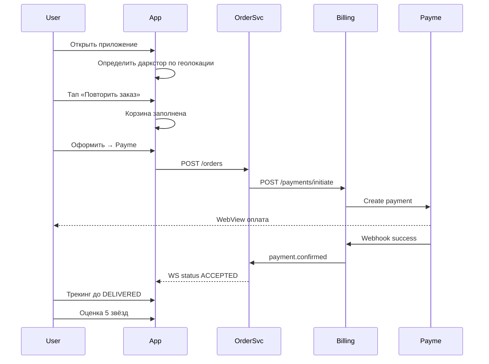

**Сценарий 2: Замена товара при сборке**

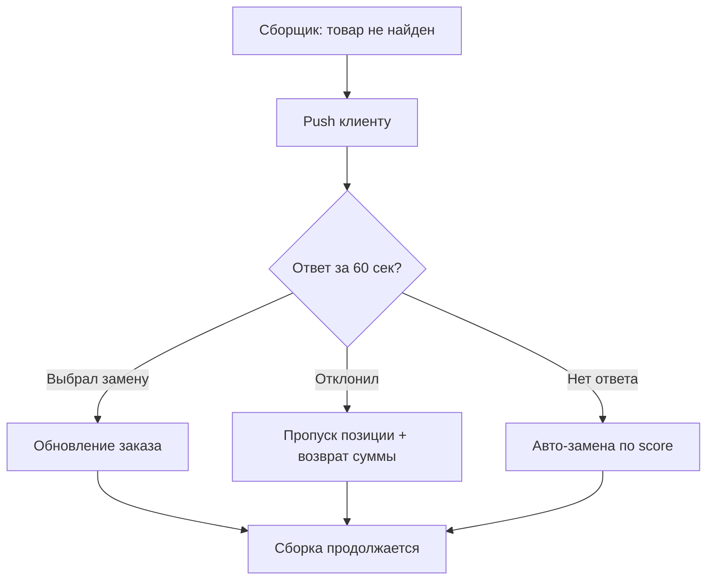

**Сценарий 3: Проблема с заказом (без кнопки «Вернуть»)**

1. Клиент: Профиль → Поддержка или Заказы → «Сообщить о проблеме»
2. Выбор типа: не доставлен, повреждён, неверный товар, другое
3. Описание + фото (опционально)
4. `POST /orders/{id}/report-problem` → тикет в Support Service
5. Оператор рассматривает в панели поддержки → возврат через Billing (частичный/полный)
6. Push/SMS клиенту о решении

**Сценарий 4: Адрес в махалле**

1. Карта: pin на здание (GPS + drag)
2. Поле «Махалля» — автодополнение из справочника 2ГИС
3. Поле «Ориентир» — обязательное (мин. 10 символов): «вход со двора, синие ворота»
4. Фото входа — опционально, рекомендуется
5. Сохранение: `delivery_address.mahalla_id`, `landmark`, `entrance_photo_url`, `coordinates`

#### 2.1.4. UI/UX принципы

**Design System Jomboy Lavka:**

| Token | Значение | Применение |
|-------|----------|------------|
| `color.primary` | `#2E7D32` | CTA, прогресс доставки, халяль-badge |
| `color.primary.light` | `#4CAF50` | Hover, secondary actions |
| `color.background` | `#FFFFFF` | Фон экранов |
| `color.surface` | `#F5F5F5` | Карточки, input fields |
| `color.text.primary` | `#1A1A1A` | Основной текст |
| `color.text.secondary` | `#757575` | Подписи, метаданные |
| `color.error` | `#D32F2F` | Ошибки, алерты |
| `font.family` | Roboto (Android), SF Pro (iOS) | — |
| `font.size.body` | 16px | Основной текст |
| `font.size.caption` | 14px | Второстепенный |
| `font.size.small` | 12px | Бейджи, метки |
| `radius.card` | 12px | Карточки товаров |
| `spacing.unit` | 8px | Grid 8pt |

**Компоненты:** `ProductCard`, `CartBar` (sticky bottom), `DeliveryProgress` (4 шага), `HalalBadge`, `PriceTag` (формат: `12 500 сум`), `AddressPicker`, `PaymentMethodSelector`.

**Принципы:**

- Главный экран: 60% лента, 30% категории, 10% поиск + корзина
- Максимум 3 тапа до корзины для топ-SKU
- Скелетоны при загрузке (shimmer), не спиннеры на весь экран
- Мягкие анимации 200–300 ms (Material motion)
- Пульсация кнопки «Заказать» при заполненной корзине
- Нет тёмной темы на MVP (фаза 3)

**Локализация:**

| Ключ | uz_Cyrl | uz_Latn | ru | en |
|------|---------|---------|----|----|
| `cart.checkout` | Буюртмани расмийлаштириш | Buyurtmani rasmiylashtirish | Оформить заказ | Checkout |
| `delivery.free_remaining` | Бепул етказишга: {amount} сўм | Bepul yetkazishga: {amount} so'm | До бесплатной доставки: {amount} сум | {amount} UZS to free delivery |

#### 2.1.5. Технические требования клиентского приложения

| Параметр | Требование |
|----------|------------|
| State management | Riverpod или Bloc |
| HTTP client | Dio + interceptors (auth, retry) |
| Local storage | Hive / SharedPreferences для корзины, языка |
| Maps | 2ГИС Flutter SDK |
| Payments | WebView для Payme/Click redirect |
| WebSocket | `web_socket_channel` для трекинга |
| Crash reporting | Firebase Crashlytics |
| Analytics | Firebase Analytics + custom events |
| Deep links | `jomboylavka://order/{id}` |
| Min RAM | 2 GB |

**События аналитики (MVP):**

- `app_open`, `product_view`, `add_to_cart`, `remove_from_cart`
- `checkout_start`, `payment_initiated`, `payment_success`, `payment_failed`
- `order_track_view`, `order_rate`, `support_contact`
- `replacement_accepted`, `replacement_rejected`

#### 2.1.6. Обработка ошибок и edge cases

| Ситуация | Поведение UI |
|----------|--------------|
| Товар закончился в корзине | Toast + удаление из корзины при checkout |
| Даркстор не обслуживает адрес | «Доставка по этому адресу скоро» + waitlist (фаза 2) |
| Оплата failed | Retry с другим провайдером (Click если Payme failed) |
| Сеть недоступна на трекинге | Last known status + «Обновление при появлении сети» |
| Замена: таймаут 60 сек | Автовыбор показать в трекинге + push с итогом |

---

### 2.2. Приложение курьера (Android, Kotlin)

#### 2.2.1. Целевая аудитория и платформа

| Параметр | Значение |
|----------|----------|
| Аудитория | Курьеры-доставщики, 20–45 лет |
| Платформа | Android 8.0+ (API 26), Kotlin 1.9 |
| Устройства | Смартфоны среднего сегмента (2–4 GB RAM) |
| Типы транспорта | Пеший, велосипед, мопед, авто |
| Ориентация | Portrait, one-hand UX |

#### 2.2.2. Ключевые экраны

| Экран | Описание | Функциональность |
|-------|----------|------------------|
| Авторизация | Вход по телефону + OTP | Keycloak, привязка к `courier_id` |
| Смена | Старт/стоп смены | Геолокация, статус online/offline, тип транспорта |
| Тепловая карта | Зоны спроса | Heatmap overlay, коэффициенты surge (фаза 3), прогноз заказов |
| Оффер заказа | Входящий заказ | Адрес (маскированный до принятия), вес, сумма, заработок, расстояние; таймер 30 сек; «Принять» / «Пропустить» |
| Активные заказы | Список (1–2) | Мультизаказ: до 2 заказов, detour ≤ 5 мин |
| Маршрут | Навигация | 2ГИС / Яндекс Карты (primary), OSRM fallback; голосовые подсказки; ETA |
| У даркстора | Pickup | QR-скан пакета, проверка состава, «Забрал заказ» |
| У клиента | Доставка | Фото входа (из заказа), ориентир, звонок (маскированный), чат |
| Завершение | Подтверждение | Фото у двери (обязательно), OTP от клиента или подпись на экране; **без COD — только онлайн-оплаченные заказы** |
| Фискализация | Чек | Отправка данных в Billing для онлайн-ККМ; SMS-чек клиенту |
| Проблема | Инцидент | Свайп влево или кнопка: не найден адрес, клиент недоступен, повреждение |
| Статистика | Личный кабинет | Заработок день/неделя/месяц, рейтинг, количество доставок, история |

#### 2.2.3. User Flow

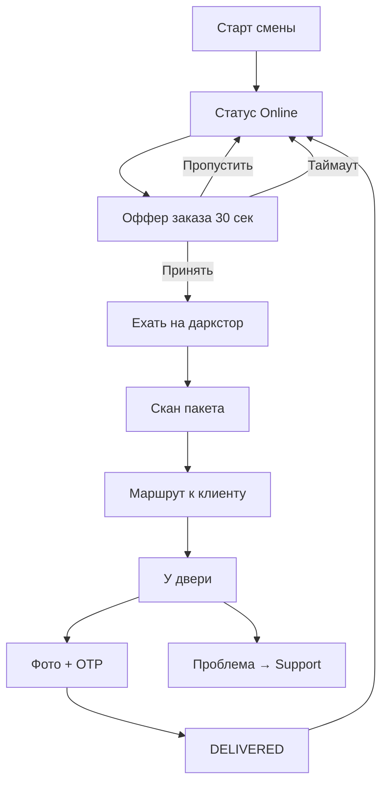

**Мультизаказ:**

1. Курьер везёт заказ A
2. Система предлагает заказ B, если `detour_minutes ≤ 5` и `total_weight ≤ 15 kg`
3. UI: два маркера на карте, оптимизированный маршрут A→B или B→A
4. Завершение каждого заказа отдельно (фото + OTP)

#### 2.2.4. Offline-режим (30 минут)

| Данные в Room DB | Синхронизация |
|------------------|---------------|
| Активные заказы (JSON) | Pull при старте смены |
| Маршрут OSRM (GeoJSON) | Кэш при принятии оффера |
| Статусы (outbox queue) | Push при восстановлении сети |
| Фото (локальные файлы) | Upload в MinIO, retry с exponential backoff |

**Поведение offline:**

- GPS продолжает запись трека (батч upload)
- Статусы `ARRIVED`, `DELIVERED` сохраняются в outbox с `idempotency_key`
- Фото сжимаются до 800 KB, хранятся локально до upload
- UI: жёлтый banner «Нет сети — данные сохранятся автоматически»

#### 2.2.5. UI/UX принципы

- Крупные кнопки (min 48dp), контрастные цвета для улицы
- Свайп вправо на экране доставки → «Доставлено»
- Свайп влево → «Проблема»
- GPS только при активном заказе (экономия батареи)
- Экран не гаснет на маршруте (FLAG_KEEP_SCREEN_ON)
- Голосовые уведомления о новых офферах

#### 2.2.6. Расчёт заработка курьера

| Компонент | UZS | Условие |
|-----------|-----|---------|
| Базовая ставка | 8 000 | За заказ в радиусе 2 км |
| Надбавка за км | 500 | Свыше 2 км |
| Надбавка вес | 1 000 | Свыше 8 кг |
| Мультизаказ бонус | 3 000 | Второй заказ в поездке |
| Пиковый коэффициент | ×1.2 | 12–14, 18–20 (фаза 3) |
| Штраф за отмену после accept | −5 000 | После PICKED_UP |

Заработок отображается в оффере до принятия. Выплата на карту UZCARD еженедельно (фаза 2 — ежедневно для топ-курьеров).

#### 2.2.7. Типы транспорта и ограничения

| Тип | Max вес | Max радиус | Средняя скорость |
|-----|---------|------------|------------------|
| Пеший | 5 кг | 1.5 км | 5 км/ч |
| Велосипед | 10 кг | 2.5 км | 15 км/ч |
| Мопед | 15 кг | 4 км | 25 км/ч |
| Авто | 30 кг | 5 км | 30 км/ч |

Система назначает офферы с учётом `courier.vehicle_type` и `order.weight_kg`.

---

### 2.3. Приложение сборщика (Android, Kotlin)

#### 2.3.1. Целевая аудитория и платформа

| Параметр | Значение |
|----------|----------|
| Аудитория | Сборщики заказов на дарксторе |
| Платформа | Android 8.0+, Kotlin, сканер штрихкодов (камера или Bluetooth) |
| Устройства | Планшет 8–10" или смартфон с креплением на руку |
| Среда | Склад: +2…+25°C, зона C до −18°C |

#### 2.3.2. Ключевые экраны

| Экран | Описание | Функциональность |
|-------|----------|------------------|
| Авторизация | OTP + выбор даркстора | Привязка к `picker_id`, зоны сертификации |
| Очередь задач | Список заказов | Приоритет по SLA, таймер до просрочки |
| Поток сборки | Текущий заказ | Товары по зонам A→F, фото, ячейка полки, таймер на позицию (2 мин) |
| Сканирование | Подтверждение SKU | QR/EAN-13, звук OK, вибрация при ошибке |
| Замена | Альтернативы | 3 варианта от Catalog, таймер 60 сек на ответ клиента |
| Весовой товар | Bluetooth-весы | Допуск ±5%, автопересчёт цены, `weighted_quantity` |
| Упаковка | Финализация | Скан QR пакета, выбор термосумки (для C), температура (ручной ввод / IoT фаза 2) |
| Передача курьеру | Handoff | Статус READY, зона выдачи |
| Статистика | KPI сборщика | Заказов сегодня, среднее время, рейтинг точности |

#### 2.3.3. User Flow — волновая сборка

```mermaid
flowchart LR
    Q[Очередь] --> Assign[Назначение сборщику]
    Assign --> ZoneA[Зона A: свежие]
    ZoneA --> ZoneB[Зона B: бакалея]
    ZoneB --> ZoneC[Зона C: заморозка]
    ZoneC --> ZoneD[Зона D: бытовая]
    ZoneD --> ZoneE[Зона E: напитки]
    ZoneE --> ZoneF[Зона F: хлеб]
    ZoneF --> Pack[Упаковка]
    Pack --> Ready[READY]
```

**Правила:**

- Таймер на весь заказ: 15 мин (алерт на 12 мин)
- Товар не найден за 2 мин → экран замены
- Сборщик без сертификации зоны C не получает заказы с заморозкой
- Хлеб (F) — всегда последний

#### 2.3.4. Offline-режим (30 минут)

- Кэш: задача, штрихкоды, фото товаров, маппинг ячеек
- Сканирование валидируется локально по кэшу EAN
- Замены: если offline — автовыбор top-1 по score, уведомление клиента при sync
- Outbox: `scan`, `replacement`, `complete` events

#### 2.3.5. UI/UX принципы

- Крупный шрифт (18px+), высокий контраст
- Одна рука: основные действия внизу экрана
- Цветовая кодировка зон (A=зелёный, C=синий/лед)
- Haptic feedback на каждое сканирование

#### 2.3.6. Интеграция с Bluetooth-весами

| Параметр | Значение |
|----------|----------|
| Протокол | BLE, SPP profile |
| Поддерживаемые модели | CAS ER, Mettler Toledo (уточнить при закупке) |
| Допуск | ±5% от заказанного веса |
| Пересчёт | `final_price = unit_price_per_kg * measured_weight` |
| Округление | До 100 UZS в пользу клиента |

При отклонении > 5% — обязательное подтверждение клиента через push (аналог замены).

---

### 2.4. Панель директора даркстора (Web, React)

#### 2.4.1. Целевая аудитория и платформа

| Параметр | Значение |
|----------|----------|
| Аудитория | Директор / управляющий даркстора |
| Платформа | Web, React 18, TypeScript, desktop 1280px+ |
| Браузеры | Chrome 100+, Safari 15+, Firefox 100+ |
| Auth | Keycloak, роль `darkstore_manager` |

#### 2.4.2. Ключевые экраны (MVP + roadmap)

| Экран | MVP | Описание |
|-------|-----|----------|
| Дашборд | Да | Real-time: активные заказы, сборщики online, курьеры на маршруте, алерты (просрочка, низкий остаток) |
| Заказы | Да | Таблица с WebSocket, фильтры по статусу, детали, ручное назначение сборщика/курьера |
| Персонал | Да | Смены, рейтинги, сертификации зон |
| Ассортимент | Да | Цены, остатки, активация SKU, импорт/экспорт Excel |
| Приёмка | Фаза 2 | Сканирование поставок, АСЛ БЕЛГИ, температурный контроль |
| Инвентаризация | Фаза 2 | Циклические подсчёты, сверка, списания |

#### 2.4.3. User Flow

1. **Операционный кризис:** Алерт просрочки → Заказы → Ручное назначение курьера → Мониторинг трекинга
2. **Out of stock:** Алерт низкого остатка → Ассортимент → Деактивация SKU → Уведомление Catalog
3. **Управление сменой:** Персонал → Проверка сертификаций → Открытие смены

#### 2.4.4. UI/UX

- Dashboard-first: KPI cards + live order map
- Тёмная тема опционально (для 24/7 мониторинга)
- Keyboard shortcuts: `j/k` навигация по заказам
- Refresh < 2 сек при WebSocket reconnect

---

### 2.5. Панель кладовщика (Web/Tablet, React)

#### 2.5.1. Целевая аудитория и платформа

| Параметр | Значение |
|----------|----------|
| Аудитория | Кладовщики, приёмщики |
| Платформа | Web + Tablet (768px+), touch-friendly |
| Фаза | Полный функционал — **фаза 2**; MVP — базовая приёмка в панели директора |

#### 2.5.2. Ключевые экраны (фаза 2)

| Экран | Функциональность |
|-------|------------------|
| Приёмка | Скан накладной, сверка с PO поставщика, недостача/брак, фото |
| Размещение | Рекомендация зоны/ячейки, скан ячейки = подтверждение |
| Инвентаризация | Плановые пересчёты, recount, корректировка |
| Списания | Брак, просрочка, порча; причина, фото, электронная подпись директора |

#### 2.5.4. User Flow — приёмка поставки (фаза 2)

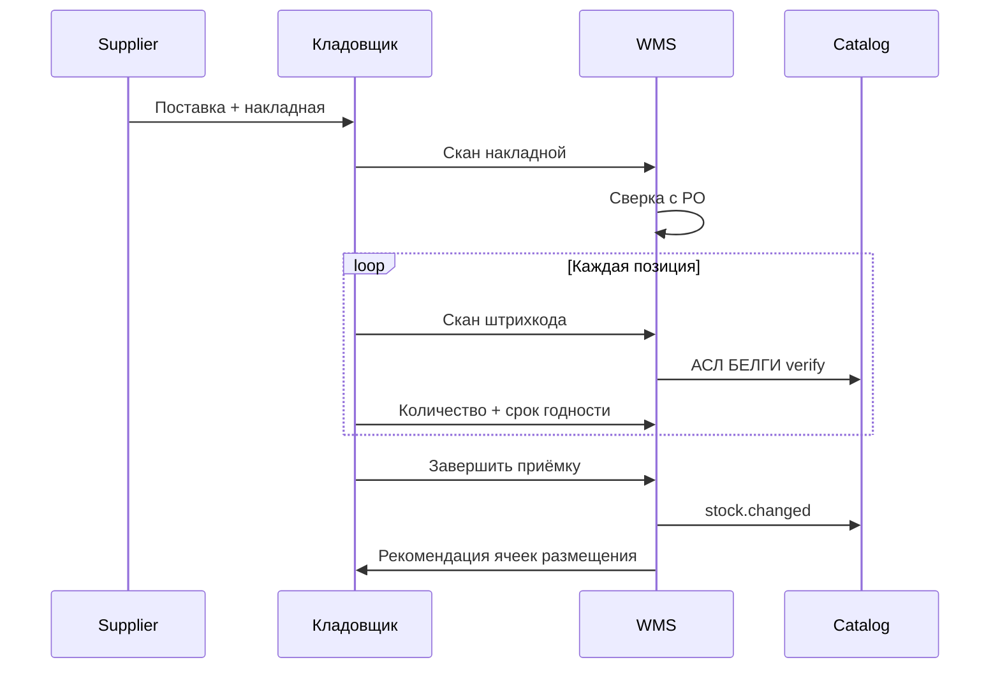

**Бизнес-правила приёмки:**

- Расхождение с PO > 5% — эскалация директору
- Срок годности < 7 дней для зоны A — отклонение партии
- Температура при приёмке заморозки: ≤ −15°C
- Фото брака обязательно для списания

---

### 2.6. Панель поддержки (Web, React)

#### 2.6.1. Целевая аудитория и платформа

| Параметр | Значение |
|----------|----------|
| Аудитория | Операторы поддержки, старшие смены |
| Платформа | Web, React, 2 монитора рекомендуется |
| MVP | Чат, тикеты, ручные возвраты |
| Фаза 3 | AI-ассистент, тайм-машина, антифрод UI |

#### 2.6.2. Ключевые экраны

| Экран | MVP | Описание |
|-------|-----|----------|
| Очередь тикетов | Да | New, In Progress, Escalated, SLA breach; авто-назначение |
| Чат | Да | WebSocket, шаблоны ответов (uz/ru), быстрые действия |
| Карточка заказа | Да | Состав, статус, оплата, клиент |
| Решение по возврату | Да | Approve / Reject / Partial; сумма; комментарий; запуск refund в Billing |
| Тайм-машина | Фаза 3 | Timeline: статусы, гео, фото, сканы, температуры |
| Антифрод | Фаза 3 | Risk score, история клиента, рекомендации |

#### 2.6.3. User Flow — возврат через поддержку

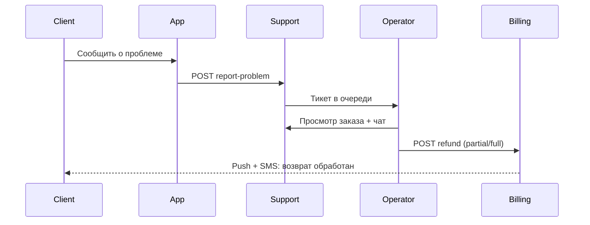

**Важно:** В клиентском приложении **нет** кнопки «Вернуть товар». Только «Сообщить о проблеме» → оператор принимает решение.

#### 2.6.4. SLA

| Приоритет | Первый ответ | Решение |
|-----------|--------------|---------|
| Critical (не доставлен, >30 мин) | 2 мин | 15 мин |
| High (повреждение, неверный товар) | 5 мин | 30 мин |
| Normal | 15 мин | 2 часа |
| Low | 1 час | 24 часа |

---

### 2.7. HQ-панель (Web, React)

#### 2.7.1. Целевая аудитория и платформа

| Параметр | Значение |
|----------|----------|
| Аудитория | Руководство, финансы, аналитики, HQ ops |
| Платформа | Web, React, desktop |
| Auth | Роли: `hq_admin`, `finance`, `analyst` (read-only) |

#### 2.7.2. Ключевые экраны

| Экран | MVP | Фаза 4 |
|-------|-----|--------|
| Сводная аналитика | Базовые метрики | Cohort, funnel, по городам |
| BI-дашборды | — | LTV, CAC, retention, NPS, Metabase embed |
| Управление тарифами | Просмотр | Редактирование доставки, surge, курьерские коэфф. |
| Аудит | Логи действий | WORM-хранение, экспорт |
| Антифрод | — | Статистика, blocked orders, false positive rate |
| Мультидаркстор | — | Самарканд + Ташкент |

#### 2.7.3. User Flow

1. **Утренний обзор:** Dashboard → GMV вчера → OTD → алерты по дарксторам
2. **Изменение тарифа доставки:** Тарифы → Редактирование → Preview impact → Publish
3. **Расследование фрода:** Антифрод → Заблокированные заказы → Детали → Разблокировка/подтверждение

#### 2.7.4. Роли и права HQ-панели

| Роль | Права |
|------|-------|
| `hq_admin` | Полный доступ, тарифы, блокировки |
| `finance` | Отчёты, экспорт, возвраты (read) |
| `analyst` | Дашборды read-only |
| `operations` | Дарксторы, персонал, алерты |

Все действия с финансовым impact логируются в audit trail с `user_id`, `timestamp`, `ip`, `payload`.

---

## 3. Backend-архитектура

### 3.1. Обзор микросервисной архитектуры

Система построена на **8 микросервисах** на Go 1.22. Для MVP этого достаточно; Loyalty и Analytics выделены в модули внутри Order/Admin API до фазы 3.

```
┌─────────────┐     ┌─────────────┐     ┌─────────────┐
│  Client App │     │  Courier    │     │  Picker     │
│  (Flutter)  │     │  App        │     │  App        │
└──────┬──────┘     └──────┬──────┘     └──────┬──────┘
       │                   │                   │
       └───────────────────┼───────────────────┘
                           │
                    ┌──────▼──────┐
                    │  Kong       │
                    │  Gateway    │
                    └──────┬──────┘
                           │
       ┌───────────────────┼───────────────────┐
       │                   │                   │
  ┌────▼────┐        ┌────▼────┐        ┌────▼────┐
  │ Catalog │        │ Order   │        │ Billing │
  │ (Go)    │        │ (Go)    │        │ (Go)    │
  └────┬────┘        └────┬────┘        └────┬────┘
       │                  │                  │
       └──────────────────┼──────────────────┘
                          │
                   ┌──────▼──────┐
                   │  NATS       │
                   │  JetStream  │
                   └──────┬──────┘
                          │
       ┌──────────────────┼──────────────────┐
       │                  │                  │
  ┌────▼────┐        ┌────▼────┐        ┌────▼────┐
  │ Picker  │        │ Courier │        │ Support │
  │ Service │        │ Service │        │ Service │
  └─────────┘        └─────────┘        └─────────┘
                          │
                   ┌──────▼──────┐
                   │ Notification│
                   │  (Go)       │
                   └──────┬──────┘
                          │
                   ┌──────▼──────┐
                   │  Admin API  │
                   │  (Go, BFF)  │
                   └─────────────┘
```

#### 3.1.1. Матрица сервисов

| Сервис | Язык | БД | Кэш | Очередь | Ответственность |
|--------|------|-----|-----|---------|-----------------|
| API Gateway | Kong | — | — | — | Rate limit, auth, routing, WAF |
| Catalog | Go 1.22 | PostgreSQL 16 | Redis | — | SKU, цены, остатки, поиск ES, замены |
| Order | Go 1.22 | PostgreSQL 16 (партиции) | Redis | NATS | Стейт-машина, антифрод rules, расчёт доставки |
| Picker | Go 1.22 | PostgreSQL 16 | Redis | NATS | Волновая сборка, сканы, замены |
| Courier | Go 1.22 | PostgreSQL 16 + PostGIS | Redis | NATS | Офферы, гео, мультизаказы, ETA |
| Billing | Go 1.22 | PostgreSQL 16 | — | NATS | Payme/Click, возвраты, ККМ |
| Support | Go 1.22 | PostgreSQL 16 | Redis | NATS | Тикеты, чат, решения по возвратам |
| Notification | Go 1.22 | — | Redis | NATS | FCM, SMS (Eskiz), email |
| Admin API | Go 1.22 | PostgreSQL 16 (read) | Redis | — | BFF для веб-панелей, RBAC, отчёты |

#### 3.1.2. События NATS JetStream

| Subject | Publisher | Consumers | Payload |
|---------|-----------|-----------|---------|
| `order.created` | Order | Picker, Notification, Admin | order_id, darkstore_id |
| `order.status_changed` | Order | Notification, Support, Admin | order_id, from, to |
| `payment.succeeded` | Billing | Order, Notification | order_id, amount, provider |
| `payment.failed` | Billing | Order, Notification | order_id, reason |
| `pick.started` | Picker | Order, Admin | order_id, picker_id |
| `pick.completed` | Picker | Order, Courier | order_id, package_id |
| `courier.assigned` | Courier | Order, Notification | order_id, courier_id |
| `delivery.completed` | Courier | Order, Billing | order_id, photo_url |
| `ticket.created` | Support | Notification | ticket_id, order_id |
| `refund.processed` | Billing | Support, Notification | order_id, amount |
| `stock.changed` | Catalog | Order, Admin | sku_id, quantity |

#### 3.1.3. Notification Service — каналы и шаблоны

| Событие | Push (FCM) | SMS (Eskiz) | Условие SMS fallback |
|---------|------------|-------------|----------------------|
| `order.status_changed` → ACCEPTED | Да | Нет | — |
| `order.status_changed` → IN_DELIVERY | Да | Нет | — |
| `order.status_changed` → DELIVERED | Да | Да (чек) | Всегда SMS с фискальным QR |
| `pick.replacement_requested` | Да | Да | Если push не доставлен 30 сек |
| `payment.failed` | Да | Нет | — |
| `refund.processed` | Да | Да | Сумма > 50 000 UZS |
| OTP login | Нет | Да | Всегда |

**Шаблон SMS (uz/ru):**

```
Jomboy Lavka: Buyurtmangiz yetkazildi. Chek: {url}. Summa: {amount} so'm.
Jomboy Lavka: Ваш заказ доставлен. Чек: {url}. Сумма: {amount} сум.
```

#### 3.1.4. Аутентификация (Keycloak)

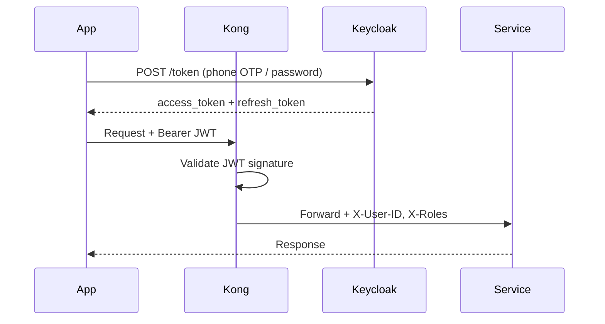

| Роль Keycloak | Приложения | Scopes |
|---------------|------------|--------|
| `customer` | Flutter client | orders:write, catalog:read |
| `courier` | Courier app | courier:* |
| `picker` | Picker app | picker:* |
| `darkstore_manager` | Director panel | admin:darkstore |
| `support` | Support panel | support:*, refund:approve |
| `hq_admin` | HQ panel | admin:* |

OTP flow: `POST /auth/otp/send` → Eskiz SMS → `POST /auth/otp/verify` → Keycloak token. Rate limit: 3 OTP / 10 мин на номер.

---

### 3.2. Стейт-машина заказа

#### 3.2.1. Диаграмма состояний

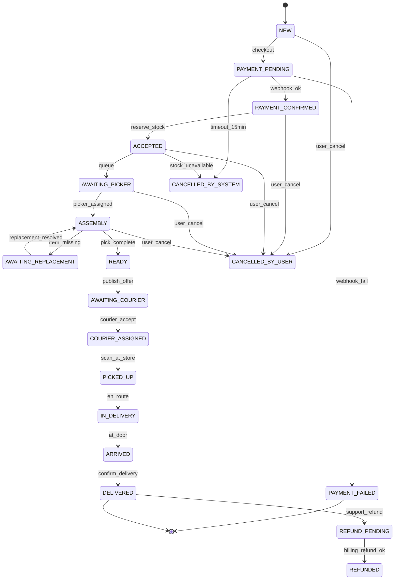

#### 3.2.2. Таблица статусов и переходов

| Статус | Описание | Кто инициирует переход | Следующие статусы |
|--------|----------|------------------------|-------------------|
| `NEW` | Корзина оформлена | Client | PAYMENT_PENDING |
| `PAYMENT_PENDING` | Ожидание оплаты | Billing | PAYMENT_CONFIRMED, PAYMENT_FAILED, CANCELLED_BY_SYSTEM |
| `PAYMENT_FAILED` | Оплата не прошла | Billing | (terminal) |
| `PAYMENT_CONFIRMED` | Оплата успешна | Billing webhook | ACCEPTED |
| `ACCEPTED` | Заказ принят, сток зарезервирован | Order | AWAITING_PICKER, CANCELLED_BY_USER, CANCELLED_BY_SYSTEM |
| `AWAITING_PICKER` | В очереди на сборку | Picker Service | ASSEMBLY |
| `ASSEMBLY` | Идёт сборка | Picker | AWAITING_REPLACEMENT, READY, CANCELLED_BY_USER |
| `AWAITING_REPLACEMENT` | Ожидание ответа клиента на замену | Picker | ASSEMBLY |
| `READY` | Собран, ждёт курьера | Picker | AWAITING_COURIER |
| `AWAITING_COURIER` | Офферы отправлены | Courier Service | COURIER_ASSIGNED |
| `COURIER_ASSIGNED` | Курьер принял | Courier | PICKED_UP |
| `PICKED_UP` | Курьер забрал с даркстора | Courier | IN_DELIVERY |
| `IN_DELIVERY` | В пути к клиенту | Courier | ARRIVED |
| `ARRIVED` | У двери клиента | Courier | DELIVERED |
| `DELIVERED` | Доставлен | Courier | REFUND_PENDING |
| `CANCELLED_BY_USER` | Отмена клиентом | Client (до ASSEMBLY) | (terminal) |
| `CANCELLED_BY_SYSTEM` | Отмена системой | Order (нет стока, таймаут оплаты) | (terminal) |
| `REFUND_PENDING` | Возврат в обработке | Support → Billing | REFUNDED |
| `REFUNDED` | Возврат выполнен | Billing | (terminal) |

#### 3.2.3. Бизнес-правила статусов

- **Отмена клиентом:** только до статуса `ASSEMBLY` включительно; полный refund через Billing
- **Отмена системой:** `PAYMENT_PENDING` > 15 мин без оплаты; `ACCEPTED` при невозможности резервирования стока
- **Возврат:** только после `DELIVERED`, в течение 24 часов, через Support (не self-service в приложении)
- **Идемпотентность:** все переходы с `idempotency_key` в заголовке `X-Idempotency-Key`

---

### 3.3. API-контракты (OpenAPI 3.0)

Базовый URL: `https://api.jomboy-lavka.uz/api/v1`

Общие заголовки: `Authorization: Bearer <JWT>`, `Accept-Language: uz-Cyrl|uz-Latn|ru|en`, `X-Request-ID`, `X-Idempotency-Key` (для POST).

#### 3.3.1. Catalog Service

```yaml
openapi: 3.0.3
info:
  title: Jomboy Lavka Catalog API
  version: 1.0.0
paths:
  /catalog/darkstores/{darkstore_id}:
    get:
      summary: Каталог даркстора
      parameters:
        - name: darkstore_id
          in: path
          required: true
          schema: { type: string, format: uuid }
        - name: category_id
          in: query
          schema: { type: string, format: uuid }
        - name: is_halal
          in: query
          schema: { type: boolean }
        - name: page
          in: query
          schema: { type: integer, default: 1 }
        - name: limit
          in: query
          schema: { type: integer, default: 20, maximum: 100 }
      responses:
        '200':
          description: OK
          content:
            application/json:
              schema:
                type: object
                properties:
                  products:
                    type: array
                    items: { $ref: '#/components/schemas/Product' }
                  pagination: { $ref: '#/components/schemas/Pagination' }
  /catalog/search:
    get:
      summary: Поиск товаров
      parameters:
        - name: q
          in: query
          required: true
          schema: { type: string, minLength: 2 }
        - name: darkstore_id
          in: query
          required: true
          schema: { type: string, format: uuid }
        - name: language
          in: query
          schema: { type: string, enum: [uz_cyrillic, uz_latin, ru, en] }
      responses:
        '200':
          description: OK
  /catalog/replacements/calculate:
    post:
      summary: Расчёт замен товара
      requestBody:
        required: true
        content:
          application/json:
            schema:
              type: object
              required: [product_id, darkstore_id, reason]
              properties:
                product_id: { type: string, format: uuid }
                darkstore_id: { type: string, format: uuid }
                reason: { type: string, enum: [out_of_stock, damaged, expired] }
      responses:
        '200':
          content:
            application/json:
              schema:
                type: object
                properties:
                  replacements:
                    type: array
                    items:
                      type: object
                      properties:
                        product: { $ref: '#/components/schemas/Product' }
                        score: { type: number }
                        price_diff: { type: integer, description: UZS }
                  timeout_seconds: { type: integer, default: 60 }
  /catalog/asl-belgisi/verify:
    post:
      summary: Проверка маркировки АСЛ БЕЛГИ
      requestBody:
        content:
          application/json:
            schema:
              type: object
              required: [code, product_id]
              properties:
                code: { type: string }
                product_id: { type: string, format: uuid }
      responses:
        '200':
          content:
            application/json:
              schema:
                type: object
                properties:
                  valid: { type: boolean }
                  offline: { type: boolean }
                  cached_at: { type: string, format: date-time }
components:
  schemas:
    Product:
      type: object
      properties:
        id: { type: string, format: uuid }
        name: { type: object, additionalProperties: { type: string } }
        price: { type: integer, description: UZS }
        weight_g: { type: integer }
        is_halal: { type: boolean }
        images: { type: array, items: { type: string, format: uri } }
        stock: { type: integer }
        zone: { type: string, enum: [A, B, C, D, E, F] }
    Pagination:
      type: object
      properties:
        page: { type: integer }
        limit: { type: integer }
        total: { type: integer }
```

#### 3.3.2. Order Service

```yaml
paths:
  /orders:
    post:
      summary: Создать заказ
      parameters:
        - name: X-Idempotency-Key
          in: header
          required: true
          schema: { type: string, format: uuid }
      requestBody:
        content:
          application/json:
            schema:
              type: object
              required: [darkstore_id, items, delivery_address, payment_method]
              properties:
                darkstore_id: { type: string, format: uuid }
                items:
                  type: array
                  items:
                    type: object
                    properties:
                      product_id: { type: string, format: uuid }
                      quantity: { type: number }
                delivery_address: { $ref: '#/components/schemas/DeliveryAddress' }
                payment_method: { type: string, enum: [payme, click] }
                promocode: { type: string }
                comment: { type: string, maxLength: 500 }
      responses:
        '201':
          content:
            application/json:
              schema:
                type: object
                properties:
                  order_id: { type: string, format: uuid }
                  status: { type: string }
                  total_amount: { type: integer }
                  delivery_fee: { type: integer }
                  estimated_delivery_minutes: { type: integer }
        '400': { description: Validation error }
        '409': { description: Idempotency conflict }
        '422': { description: Stock unavailable }
  /orders/{order_id}:
    get:
      summary: Статус заказа
      responses:
        '200':
          content:
            application/json:
              schema: { $ref: '#/components/schemas/Order' }
  /orders/{order_id}/cancel:
    post:
      summary: Отмена заказа (до ASSEMBLY)
      requestBody:
        content:
          application/json:
            schema:
              type: object
              properties:
                reason: { type: string }
      responses:
        '200': { description: Cancelled }
        '403': { description: Cancel not allowed in current status }
  /orders/{order_id}/stream:
    get:
      summary: WebSocket трекинг заказа
      description: WS upgrade, события status_changed, courier_location, eta_updated
  /orders/{order_id}/report-problem:
    post:
      summary: Сообщить о проблеме (создаёт тикет, не возврат напрямую)
      requestBody:
        content:
          application/json:
            schema:
              type: object
              required: [problem_type, description]
              properties:
                problem_type: { type: string, enum: [not_delivered, damaged, wrong_item, missing_items, other] }
                description: { type: string }
                product_ids: { type: array, items: { type: string, format: uuid } }
                photo_urls: { type: array, items: { type: string, format: uri } }
      responses:
        '201':
          content:
            application/json:
              schema:
                type: object
                properties:
                  ticket_id: { type: string, format: uuid }
                  status: { type: string, enum: [open] }
  /delivery/quote:
    post:
      summary: Расчёт стоимости доставки
      requestBody:
        content:
          application/json:
            schema:
              type: object
              properties:
                darkstore_id: { type: string, format: uuid }
                cart_total: { type: integer }
                coordinates: { type: object, properties: { lat: { type: number }, lng: { type: number } } }
                mahalla_id: { type: string }
      responses:
        '200':
          content:
            application/json:
              schema:
                type: object
                properties:
                  delivery_fee: { type: integer }
                  estimated_minutes: { type: integer }
                  breakdown: { type: object }
components:
  schemas:
    DeliveryAddress:
      type: object
      properties:
        coordinates: { type: object }
        mahalla_id: { type: string }
        landmark: { type: string }
        entrance_photo_url: { type: string }
        flat: { type: string }
        floor: { type: string }
    Order:
      type: object
      properties:
        id: { type: string, format: uuid }
        status: { type: string }
        items: { type: array }
        total_amount: { type: integer }
        courier: { type: object, nullable: true }
        eta_minutes: { type: integer, nullable: true }
```

#### 3.3.3. Picker Service

```yaml
paths:
  /picker/tasks/next:
    get:
      summary: Следующая задача сборки
      responses:
        '200':
          content:
            application/json:
              schema:
                type: object
                properties:
                  order_id: { type: string, format: uuid }
                  sla_deadline: { type: string, format: date-time }
                  items:
                    type: array
                    items:
                      type: object
                      properties:
                        product_id: { type: string }
                        name: { type: string }
                        zone: { type: string }
                        shelf: { type: string }
                        photo_url: { type: string }
                        quantity: { type: number }
                        barcode: { type: string }
        '204': { description: No tasks available }
  /picker/tasks/{order_id}/start:
    post:
      responses:
        '200': { description: Assembly started }
  /picker/tasks/{order_id}/scan:
    post:
      requestBody:
        content:
          application/json:
            schema:
              type: object
              required: [product_id, barcode]
              properties:
                product_id: { type: string }
                barcode: { type: string }
      responses:
        '200': { description: Scan OK }
        '400': { description: Barcode mismatch }
  /picker/tasks/{order_id}/replacement:
    post:
      requestBody:
        content:
          application/json:
            schema:
              type: object
              properties:
                original_product_id: { type: string }
                reason: { type: string }
      responses:
        '200':
          content:
            application/json:
              schema:
                type: object
                properties:
                  replacement_options: { type: array }
                  timeout_seconds: { type: integer }
  /picker/tasks/{order_id}/complete:
    post:
      requestBody:
        content:
          application/json:
            schema:
              type: object
              properties:
                items_scanned: { type: array }
                package_id: { type: string }
                thermal_bag_id: { type: string }
      responses:
        '200': { description: Order READY }
```

#### 3.3.4. Courier Service

```yaml
paths:
  /courier/offers:
    get:
      summary: Доступные офферы
      responses:
        '200':
          content:
            application/json:
              schema:
                type: object
                properties:
                  offers:
                    type: array
                    items:
                      type: object
                      properties:
                        order_id: { type: string }
                        address_masked: { type: string }
                        amount: { type: integer }
                        earnings: { type: integer }
                        distance_km: { type: number }
                        weight_kg: { type: number }
                        expires_at: { type: string, format: date-time }
  /courier/offers/{order_id}/accept:
    post:
      responses:
        '200': { description: Accepted }
        '409': { description: Offer expired or taken }
  /courier/orders/{order_id}/status/pickup:
    post:
      summary: Забрал заказ на дарксторе
  /courier/orders/{order_id}/status/arrived:
    post:
      summary: У двери клиента
  /courier/orders/{order_id}/status/delivered:
    post:
      requestBody:
        content:
          application/json:
            schema:
              type: object
              required: [photo_url]
              properties:
                photo_url: { type: string }
                confirmation_code: { type: string }
                signature_data: { type: string }
      responses:
        '200': { description: Delivered }
  /courier/location:
    post:
      summary: Batch геолокация (каждые 10 сек в доставке)
      requestBody:
        content:
          application/json:
            schema:
              type: object
              properties:
                points: { type: array, items: { type: object } }
```

#### 3.3.5. Billing Service

```yaml
paths:
  /payments/initiate:
    post:
      summary: Инициация оплаты
      requestBody:
        content:
          application/json:
            schema:
              type: object
              required: [order_id, amount, provider]
              properties:
                order_id: { type: string, format: uuid }
                amount: { type: integer, description: UZS }
                provider: { type: string, enum: [payme, click] }
      responses:
        '200':
          content:
            application/json:
              schema:
                type: object
                properties:
                  payment_id: { type: string }
                  redirect_url: { type: string }
                  provider: { type: string }
  /payments/webhook/payme:
    post:
      summary: Webhook Payme (подпись MD5)
      security: []
  /payments/webhook/click:
    post:
      summary: Webhook Click
      security: []
  /refunds:
    post:
      summary: Возврат (только Support role)
      requestBody:
        content:
          application/json:
            schema:
              type: object
              required: [order_id, amount, reason, ticket_id]
              properties:
                order_id: { type: string }
                amount: { type: integer }
                reason: { type: string }
                ticket_id: { type: string }
                type: { type: string, enum: [full, partial] }
      responses:
        '200':
          content:
            application/json:
              schema:
                type: object
                properties:
                  refund_id: { type: string }
                  status: { type: string, enum: [pending, completed, failed] }
  /receipts/{receipt_id}:
    get:
      summary: Фискальный чек (онлайн-ККМ)
      responses:
        '200':
          content:
            application/json:
              schema:
                type: object
                properties:
                  fiscal_sign: { type: string }
                  qr_code_url: { type: string }
                  sms_sent: { type: boolean }
```

#### 3.3.6. Support Service (возвраты)

```yaml
paths:
  /tickets:
    post:
      summary: Создать тикет
      requestBody:
        content:
          application/json:
            schema:
              type: object
              properties:
                order_id: { type: string }
                type: { type: string }
                description: { type: string }
                priority: { type: string }
    get:
      summary: Очередь тикетов (оператор)
      parameters:
        - name: status
          in: query
          schema: { type: string }
  /tickets/{ticket_id}/refund-decision:
    post:
      summary: Решение по возврату
      requestBody:
        content:
          application/json:
            schema:
              type: object
              required: [decision]
              properties:
                decision: { type: string, enum: [approve, reject, partial] }
                amount: { type: integer }
                comment: { type: string }
      responses:
        '200': { description: Triggers Billing refund if approved }
  /orders/{order_id}/timeline:
    get:
      summary: Тайм-машина заказа (фаза 3)
      responses:
        '200':
          content:
            application/json:
              schema:
                type: object
                properties:
                  events:
                    type: array
                    items:
                      type: object
                      properties:
                        timestamp: { type: string }
                        type: { type: string }
                        actor: { type: string }
                        payload: { type: object }
```

---

### 3.4. Бизнес-логика

#### 3.4.1. Волновая сборка

```go
// Псевдокод назначения сборщика
func AssignPicker(order Order) (*Picker, error) {
    zones := order.RequiredZones() // e.g. [A, B, C, F]
    pickers := repo.FindAvailablePickers(order.DarkstoreID)
    
    var candidates []Picker
    for _, p := range pickers {
        if p.HasZoneCertification(zones) && p.CurrentLoad() < MaxConcurrentOrders {
            candidates = append(candidates, p)
        }
    }
    if len(candidates) == 0 {
        return nil, ErrNoPickerAvailable
    }
    
    // Score: минимальная текущая нагрузка, затем рейтинг
    sort.Slice(candidates, func(i, j int) bool {
        if candidates[i].CurrentLoad() != candidates[j].CurrentLoad() {
            return candidates[i].CurrentLoad() < candidates[j].CurrentLoad()
        }
        return candidates[i].Rating() > candidates[j].Rating()
    })
    
    picker := candidates[0]
    task := BuildWaveTask(order, zones) // items sorted A→F
    repo.AssignTask(picker.ID, task)
    nats.Publish("pick.assigned", task)
    return &picker, nil
}
```

**Параметры:**

| Параметр | Значение |
|----------|----------|
| Max concurrent orders per picker | 1 (MVP) |
| SLA сборки | 15 мин |
| Таймаут на позицию | 2 мин → замена |
| Таймаут ответа клиента на замену | 60 сек |

#### 3.4.2. Назначение курьера

```go
func OfferCouriers(order Order) error {
    couriers := repo.FindOnlineCouriers(order.DarkstoreID, radiusKm: 3.0)
    
    for _, c := range rankCouriers(couriers, order) {
        if c.Vehicle.CanCarry(order.WeightKg) {
            offer := Offer{
                OrderID:   order.ID,
                Earnings:  calculateEarnings(order),
                ExpiresAt: time.Now().Add(30 * time.Second),
            }
            push.Send(c.DeviceToken, offer)
            if waitAccept(offer, 30*time.Second) {
                return assignCourier(order, c)
            }
        }
    }
    return ErrNoCourierAccepted
}

func rankCouriers(couriers []Courier, order Order) []Courier {
    // Score = 0.4*distance^-1 + 0.3*rating + 0.2*accept_rate + 0.1*vehicle_match
}
```

#### 3.4.3. Мультизаказы

| Constraint | Значение |
|------------|----------|
| Max orders per courier | 2 |
| Max detour | 5 минут (OSRM) |
| Max total weight | 15 kg |
| Max volume | 40 л |
| Заморозка + горячее | Запрещено в одном мультизаказе (фаза 2) |

Алгоритм: при `IN_DELIVERY` заказа A проверить очередь `READY` заказов; для каждого B вычислить `detour = OSRM(A_dest → B_pickup → B_dest) - OSRM(A_dest)`; если detour ≤ 5 мин — отправить оффер.

#### 3.4.4. Расчёт стоимости доставки (динамический)

```go
func CalculateDeliveryFee(cartTotal int, distanceKm float64, ctx DeliveryContext) int {
    fee := 0
    
    // Базовая стоимость
    if cartTotal < 100_000 { // UZS
        fee = 15_000
    }
    
    // Расстояние
    if distanceKm > 3.0 {
        fee += int((distanceKm - 3.0) * 500) // +500 UZS/km
    }
    
    // Пик
    if ctx.IsPeakHour() { // 12-14, 18-20
        fee = int(float64(fee) * 1.20)
    }
    
    // Погода
    if ctx.Weather == "rain" || ctx.Weather == "snow" {
        fee = int(float64(fee) * 1.30)
    }
    
    // Махалля (сложная навигация)
    if ctx.IsMahallaComplex {
        fee += 3_000
    }
    
    return fee
}
```

| Условие | Надбавка/скидка |
|---------|-----------------|
| Заказ ≥ 100 000 UZS | Бесплатная базовая доставка |
| Заказ < 100 000 UZS | 15 000 UZS |
| Расстояние > 3 км | +500 UZS/км |
| Пик 12:00–14:00, 18:00–20:00 | +20% |
| Дождь/снег | +30% |
| Сложная махалля | +3 000 UZS |

#### 3.4.5. Антифрод (MVP — rules в Order Service)

| Правило | Действие |
|---------|----------|
| > 3 заказа/час с одного device_id | Flag + manual review |
| Адрес ≠ геолокация > 2 км | Flag |
| Новый аккаунт + заказ > 500 000 UZS | Block + Support |
| > 2 refund за 30 дней | Flag |
| Payment velocity > 5/10 мин | Block 15 мин |

Фаза 3: ML-модель на исторических данных.

#### 3.4.6. Резервирование стока

```go
func ReserveStock(order Order) error {
    tx := db.Begin()
    for _, item := range order.Items {
        result := tx.Exec(`
            UPDATE stock SET reserved = reserved + $1, available = available - $1
            WHERE sku_id = $2 AND darkstore_id = $3 AND available >= $1
        `, item.Quantity, item.ProductID, order.DarkstoreID)
        if result.RowsAffected == 0 {
            tx.Rollback()
            return ErrInsufficientStock
        }
    }
    tx.Commit()
    nats.Publish("stock.changed", order.Items)
    return nil
}
```

- Резерв при `PAYMENT_CONFIRMED`
- Освобождение при `CANCELLED_*`
- Списание при `DELIVERED`
- TTL резерва: 2 часа (auto-release при зависании)

#### 3.4.7. Admin API (BFF) — ключевые endpoints

```yaml
paths:
  /admin/darkstores/{id}/dashboard:
    get:
      summary: Real-time дашборд даркстора
      responses:
        '200':
          content:
            application/json:
              schema:
                type: object
                properties:
                  active_orders: { type: integer }
                  pickers_online: { type: integer }
                  couriers_on_route: { type: integer }
                  alerts: { type: array }
  /admin/inventory/{sku_id}:
    patch:
      summary: Корректировка остатка
      requestBody:
        content:
          application/json:
            schema:
              type: object
              properties:
                quantity_delta: { type: integer }
                reason: { type: string }
  /admin/orders/{id}/reassign:
    post:
      summary: Ручное назначение сборщика/курьера
      requestBody:
        content:
          application/json:
            schema:
              type: object
              properties:
                picker_id: { type: string }
                courier_id: { type: string }
  /admin/reports/gmv:
    get:
      summary: Отчёт GMV
      parameters:
        - name: from
          in: query
          schema: { type: string, format: date }
        - name: to
          in: query
          schema: { type: string, format: date }
```

#### 3.4.8. Схема данных Order (упрощённая)

```sql
CREATE TABLE orders (
    id UUID PRIMARY KEY,
    darkstore_id UUID NOT NULL,
    customer_id UUID NOT NULL,
    status VARCHAR(32) NOT NULL,
    subtotal INTEGER NOT NULL,          -- UZS
    delivery_fee INTEGER NOT NULL,
    total_amount INTEGER NOT NULL,
    payment_method VARCHAR(16),
    payment_id VARCHAR(64),
    delivery_address JSONB NOT NULL,
    comment TEXT,
    created_at TIMESTAMPTZ NOT NULL,
    updated_at TIMESTAMPTZ NOT NULL
) PARTITION BY RANGE (created_at);

CREATE TABLE order_items (
    id UUID PRIMARY KEY,
    order_id UUID NOT NULL,
    product_id UUID NOT NULL,
    quantity DECIMAL(10,3) NOT NULL,
    unit_price INTEGER NOT NULL,
    total_price INTEGER NOT NULL,
    is_substitution BOOLEAN DEFAULT FALSE,
    original_product_id UUID
);

CREATE INDEX idx_orders_status ON orders(status, darkstore_id);
CREATE INDEX idx_orders_customer ON orders(customer_id, created_at DESC);
```

#### 3.4.9. Версионирование API и обратная совместимость

- URL versioning: `/api/v1/`, `/api/v2/` (при breaking changes)
- Deprecation policy: 6 месяцев поддержки старой версии после анонса
- Mobile apps: min supported version enforced через `GET /config/app` (force update при critical)

---

## 4. Инфраструктура

### 4.1. Data residency — Uztelecom Cloud

Все данные (ПДн, транзакции, логи, бэкапы) хранятся **исключительно на территории Узбекистана** в Uztelecom Cloud (регион Ташкент). Запрещено реплицирование в зарубежные регионы без явного согласия регулятора и клиента.

| Требование | Реализация |
|------------|------------|
| Юрисдикция | РУз, закон «О персональных данных» № ЗРУ-547 |
| Локация ЦОД | Uztelecom Cloud, Ташкент |
| Cross-border transfer | Запрещён для ПДн |
| CDN | Локальный edge (Uztelecom) для статики; API — только UZ |

### 4.2. Kubernetes-кластер

| Компонент | Конфигурация | Назначение |
|-----------|--------------|------------|
| Worker nodes | 3 × (8 vCPU, 32 GB RAM, 500 GB SSD) | Workloads микросервисов |
| Control plane | Managed K8s (Uztelecom) | 3 master (HA) |
| Ingress | Kong Ingress Controller | TLS termination, routing |
| Service mesh | Istio (mTLS) | Межсервисная коммуникация |
| Namespace | `prod`, `staging`, `monitoring`, `data` | Изоляция |

**Распределение подов (prod):**

| Deployment | Replicas | CPU req/limit | Memory req/limit |
|------------|----------|---------------|------------------|
| catalog | 2 | 200m/500m | 256Mi/512Mi |
| order | 3 | 500m/1000m | 512Mi/1Gi |
| picker | 2 | 200m/500m | 256Mi/512Mi |
| courier | 2 | 300m/600m | 384Mi/768Mi |
| billing | 2 | 200m/500m | 256Mi/512Mi |
| support | 2 | 200m/500m | 256Mi/512Mi |
| notification | 2 | 100m/300m | 128Mi/256Mi |
| admin-api | 2 | 200m/500m | 256Mi/512Mi |
| kong | 2 | 500m/1000m | 512Mi/1Gi |

### 4.3. Data layer

| Компонент | Технология | Конфигурация |
|-----------|------------|--------------|
| RDBMS | PostgreSQL 16 + Patroni | 3 ноды, sync replica, auto-failover |
| Кэш | Redis Cluster | 6 нод (3 master + 3 replica) |
| Очереди | NATS JetStream | 3 ноды, R=3, storage 100 GB |
| Поиск | Elasticsearch 8.x | 3 ноды, 1 shard/replica min |
| Object storage | MinIO (S3-compatible) | 4 ноды, erasure coding EC:2 |
| Connection pool | PgBouncer | Per-service pools, max 100 conn |

**PostgreSQL:**

- Партиционирование `orders` по `created_at` (monthly)
- PostGIS extension для Courier Service
- Ежедневные full backup + WAL archiving в MinIO
- RPO: 1 час, RTO: 4 часа (MVP)

### 4.4. Мониторинг и observability

| Инструмент | Назначение |
|------------|------------|
| Prometheus | Метрики приложений и инфраструктуры |
| Grafana | Дашборды, SLO, алерты |
| Loki | Централизованные логи |
| Alertmanager | Маршрутизация алертов (Telegram, PagerDuty фаза 4) |
| Jaeger (фаза 2) | Distributed tracing |
| Sentry | Error tracking (mobile + backend) |

**SLO MVP (99.5% uptime):**

- Допустимый downtime: **3 ч 39 мин / месяц**
- Error budget: 0.5% failed requests
- Алерты:
  - `p99_latency > 500ms` — 5 мин → warning
  - `payment_failure_rate > 2%` — 3 мин → critical
  - `pick_sla_breach > 10%` — 10 мин → warning
  - `pod_restart_loop` — immediate → critical

**Ключевые дашборды Grafana:**

1. Business: заказы/час, GMV, OTD, cancel rate
2. API: RPS, latency p50/p95/p99, error rate по сервисам
3. Infrastructure: CPU, memory, disk, PG connections
4. Payments: success rate Payme vs Click, webhook lag

### 4.5. CI/CD

```yaml
# .gitlab-ci.yml (концепт)
stages:
  - lint
  - test
  - build
  - security-scan
  - deploy-staging
  - deploy-prod

variables:
  GO_VERSION: "1.22"
  DOCKER_REGISTRY: registry.jomboy-lavka.uz

lint:
  stage: lint
  script:
    - golangci-lint run ./...
    - eslint src/ # frontend

test:
  stage: test
  script:
    - go test -coverprofile=coverage.out ./...
    - coverage_threshold: 60%

build:
  stage: build
  script:
    - docker build -t $DOCKER_REGISTRY/$SERVICE:$CI_COMMIT_SHA .
    - docker push $DOCKER_REGISTRY/$SERVICE:$CI_COMMIT_SHA

security-scan:
  stage: security-scan
  script:
    - trivy image $DOCKER_REGISTRY/$SERVICE:$CI_COMMIT_SHA
    - gitleaks detect

deploy-staging:
  stage: deploy-staging
  script:
    - argocd app sync jomboy-staging --revision $CI_COMMIT_SHA

deploy-prod:
  stage: deploy-prod
  when: manual
  only:
    - main
  script:
    - argocd app sync jomboy-prod --revision $CI_COMMIT_SHA
```

**GitOps (ArgoCD):**

- Репозиторий `jomboy-k8s-manifests`: Helm charts per service
- Staging: auto-deploy на каждый merge в `main`
- Production: manual approve + canary 10% → 50% → 100% (фаза 2)

### 4.6. Безопасность

| Слой | Реализация | Детали |
|------|------------|--------|
| **Transit** | TLS 1.3 | Все внешние и внутренние API |
| **mTLS** | Istio | Сервис-to-сервис, сертификаты 24h auto-rotate |
| **Auth** | JWT RS256 + Keycloak | Access 15 min, refresh 7 days |
| **Secrets** | HashiCorp Vault | DB passwords, API keys Payme/Click, rotation 90 дней |
| **At rest** | AES-256 | PG TDE, MinIO SSE-S3, Redis AUTH + TLS |
| **Network** | Private subnets, NSG | DB/Redis только internal; WAF на Kong |
| **RBAC** | Keycloak roles | `customer`, `courier`, `picker`, `darkstore_manager`, `support`, `hq_admin` |
| **Audit** | Admin API logs | WORM в MinIO (фаза 4), retention 3 года |
| **DDoS** | Uztelecom + Kong rate limit | 100 req/min per IP на public API |

**Шифрование ПДн:**

- Телефон: hashed (bcrypt) + encrypted (AES-GCM) для отображения
- Адреса: encrypted at rest
- Платёжные данные: не хранятся (PCI SAQ-A); только `payment_id` от провайдера

### 4.7. Требования к доступности

| Этап | Uptime SLA | Max downtime/мес | RTO | RPO |
|------|------------|------------------|-----|-----|
| MVP (мес 1–4) | 99.5% | 3.6 ч | 4 ч | 1 ч |
| 6 мес | 99.7% | 2.2 ч | 2 ч | 30 мин |
| 12 мес | 99.9% | 43 мин | 1 ч | 15 мин |

**Disaster recovery (MVP):**

- Patroni auto-failover PostgreSQL (< 30 сек)
- Redis Sentinel failover
- Multi-AZ в пределах одного региона Uztelecom
- Runbook: восстановление из backup — ежеквартальная проверка

### 4.8. Сетевая топология (Uztelecom Cloud)

```
Internet
    │
    ▼
[WAF / DDoS Protection]
    │
    ▼
[Kong Ingress - public subnet]
    │
    ├──► [K8s pods - private subnet]
    │         ├── catalog, order, billing, ...
    │         └── admin-api
    │
    ├──► [PostgreSQL Patroni - data subnet]
    ├──► [Redis Cluster - data subnet]
    ├──► [NATS JetStream - data subnet]
    ├──► [Elasticsearch - data subnet]
    └──► [MinIO - data subnet]

[Vault - management subnet]
[GitLab Runner - CI subnet]
```

**Firewall rules:**

- Public: только 443 → Kong
- Internal: сервисы → DB/Redis/NATS по whitelist портов
- Egress: Payme, Click, FCM, Eskiz, 2ГИС — по FQDN whitelist
- SSH: только через bastion host + VPN

### 4.9. Capacity planning (12 месяцев)

| Метрика | MVP | 6 мес | 12 мес |
|---------|-----|-------|--------|
| Заказов/день | 200 | 500 | 1 000 |
| Peak RPS | 500 | 800 | 1 200 |
| PG storage | 50 GB | 150 GB | 400 GB |
| MinIO (фото) | 100 GB | 500 GB | 1.5 TB |
| ES indices | 5 GB | 20 GB | 50 GB |
| K8s nodes | 3 | 4 | 6 |

Autoscaling (фаза 2): HPA по CPU 70% и custom metric `orders_per_minute`.

---

## 5. Интеграции

### 5.1. Сводная таблица

| Система | Назначение | Протокол | Fallback | Offline | Сервис |
|---------|------------|----------|----------|---------|--------|
| Payme | Эквайринг UZCARD/HUMO | REST + WebView | Click | — | Billing |
| Click | Эквайринг | REST + WebView | Payme | — | Billing |
| Uzum Bank BNPL | Рассрочка | REST | — | — | Billing (фаза 3) |
| АСЛ БЕЛГИ | Маркировка товаров | REST API | Кэш 72ч | Да | Catalog, Picker |
| Онлайн-ККМ | Фискализация | REST | Резервный ККМ | Очередь | Billing |
| Яндекс Карты | Навигация курьера | SDK | 2ГИС | Кэш маршрута | Courier App |
| 2ГИС | Навигация, махалли | SDK/API | OSRM | Кэш | Courier App, Order |
| OSRM | ETA, маршруты | Self-hosted HTTP | Haversine | Да | Courier Service |
| Firebase FCM | Push | HTTP v1 | SMS | — | Notification |
| Eskiz.uz | SMS | REST | Play Mobile UZ | Queue | Notification |
| Soliq | Налоговая отчётность | XML export | Ручная выгрузка | — | Admin API |

### 5.2. Payme / Click (онлайн-эквайринг)

**Архитектура dual acquirer:**

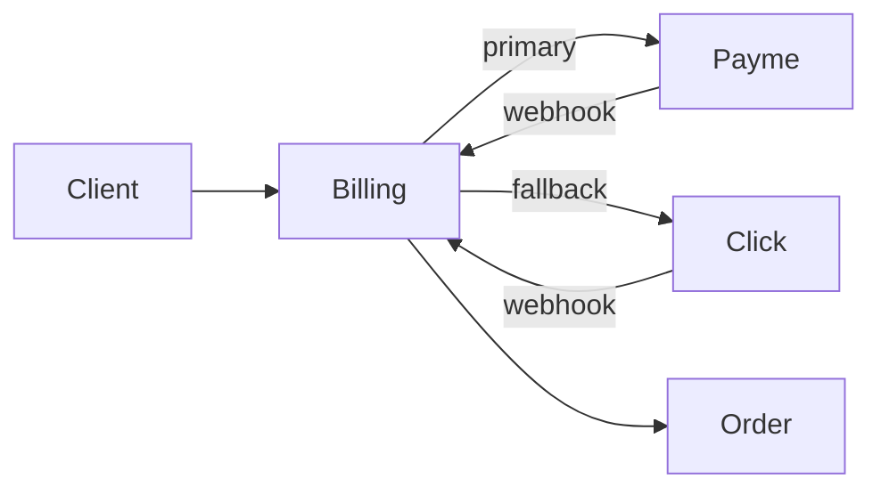

**Payme:**

- Merchant API: `https://checkout.paycom.uz/api`
- Методы: UZCARD, HUMO, Payme кошелёк
- Webhook: POST `/payments/webhook/payme`, подпись MD5(`params + key`)
- Idempotency: `payment_id` unique constraint
- Timeout оплаты: 15 мин → `CANCELLED_BY_SYSTEM`

**Click:**

- API: `https://api.click.uz/v2/merchant`
- Fallback при: Payme 5xx, timeout 3 сек, decline rate > 10% за 5 мин
- Автопереключение через circuit breaker (resilience4go pattern)

**Правила:**

- Только онлайн-оплата; COD не поддерживается
- 3DS: по требованию банка-эмитента
- Возврат: API refund в течение 30 дней, partial supported

### 5.3. АСЛ БЕЛГИ (маркировка)

| Параметр | Значение |
|----------|----------|
| API | `https://aslbelgisi.uz/api/v1/verify` |
| Offline cache | 72 часа в Redis + SQLite на планшете кладовщика |
| Проверка | При приёмке (фаза 2) и сборке маркированных SKU |
| При offline | `valid: true, offline: true` если код в кэше и не expired |
| При ошибке API | Блокировка приёмки маркированного товара (фаза 2) |

### 5.4. Онлайн-ККМ (фискализация)

- Провайдер: локальный ОФД (например, Soliq.uz интеграция)
- Триггер: `payment.succeeded` → очередь фискализации
- Retry: exponential backoff, max 10 попыток
- Резервный ККМ: физический аппарат на дарксторе при outage ОФД > 1 час
- SMS-чек клиенту через Eskiz.uz с QR фискального знака
- 100% заказов должны иметь фискальный чек в течение 24 часов

### 5.5. Навигация и ETA

**Primary chain:** 2ГИС SDK (махалли, POI) → Яндекс Карты (fallback) → OSRM self-hosted

**OSRM (self-hosted):**

- Деплой в K8s, данные OpenStreetMap Узбекистан
- Endpoint: `/route/v1/driving/{coordinates}`
- Использование: ETA при оффере курьеру, мультизаказ detour calculation
- Обновление карт: ежемесячно

**Махалли:**

- Справочник `mahalla_id` из 2ГИС API
- Поле `is_complex_navigation: bool` — ручная разметка HQ
- Surcharge +3 000 UZS при `is_complex_navigation = true`

### 5.6. Push и SMS

**Firebase FCM:**

- Каналы: `order_updates`, `promotions`, `replacements`
- Data messages для silent update (трекинг)
- При недоставке push 30 сек → SMS fallback

**Eskiz.uz SMS:**

- OTP авторизация
- «Заказ доставлен», «Возврат обработан»
- Шаблоны на uz/ru
- Rate limit: 5 SMS/час на номер

### 5.7. Soliq (налоговая отчётность)

- Ежемесячная XML-выгрузка продаж
- НДС 12% (актуальная ставка РУз на момент запуска)
- Интеграция Admin API → export job → SFTP Soliq (фаза 2)
- MVP: ручной экспорт из HQ-панели

### 5.8. Специфика Узбекистана в интеграциях

| Фактор | Решение |
|--------|---------|
| Жара +45°C | Термосумки с хладоэлементами; IoT-логгеры (фаза 2); алерт при t > 8°C в сумке > 15 мин |
| Махалли | 2ГИС + поле ориентира + фото входа; surcharge за сложную навигацию |
| Халяль | Фильтр каталога, badge, сертификат в карточке; отдельная зона A для мяса |
| 4 языка | i18n во всех клиентах; SMS/push на языке профиля |
| Рамазан (фаза 3) | Расширенные слоты доставки до suhur, промо |

### 5.9. Детальная спецификация webhook Payme

```json
{
  "method": "PerformTransaction",
  "params": {
    "id": "transaction_id",
    "time": 1719493200000,
    "amount": 8000000,
    "account": { "order_id": "uuid" }
  }
}
```

**Обработка в Billing Service:**

1. Верификация подписи `X-Auth` header
2. Idempotency check по `transaction_id`
3. Сверка `amount` с `order.total_amount * 100` (tiyin)
4. Publish `payment.succeeded` → Order Service
5. Постановка в очередь фискализации
6. Response `{"result": {"state": 2}}` — success

**Ошибки:**

| Код | Действие |
|-----|----------|
| Amount mismatch | Reject + alert fraud |
| Order not found | Reject |
| Duplicate transaction | Return success (idempotent) |
| Order already paid | Return success |

### 5.10. IoT-термометры (фаза 2)

| Параметр | Значение |
|----------|----------|
| Устройство | BLE-логгер (например, SensorPush или аналог) |
| Частота замера | Каждые 60 сек в термосумке |
| Порог алерта | > 8°C для заморозки, > 12°C для охлаждёнки |
| Длительность алерта | > 15 мин → эскалация директору |
| Хранение | TimescaleDB / PG hypertable, retention 90 дней |
| Интеграция | Courier App читает BLE, batch upload на даркстор |

---

## 6. Дорожная карта (14 месяцев)

### 6.1. Обзор фаз

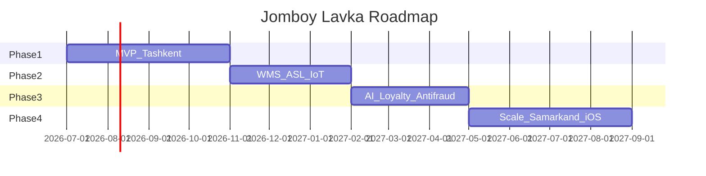

### 6.2. Фаза 1: MVP (месяцы 1–4)

**Цель:** Запуск в Ташкенте, 1 даркстор, 3 900 SKU, доставка < 20 мин в центре.

**Состав команды:** 14 FTE (см. раздел 7)

| Неделя | Задача | Команда |
|--------|--------|---------|
| 1–2 | K8s Uztelecom, CI/CD, мониторинг, Vault | DevOps |
| 2–4 | Catalog Service + PostgreSQL + Elasticsearch | Backend × 2 |
| 3–5 | Order Service + стейт-машина + delivery quote | Backend × 2 |
| 4–6 | Kong Gateway + Keycloak + JWT auth | Backend + DevOps |
| 5–7 | Flutter клиент Android MVP | Flutter + Designer |
| 6–8 | Payme/Click + Billing Service + ККМ | Backend |
| 7–9 | Picker Service + приложение сборщика | Backend + Android |
| 8–10 | Courier Service + приложение курьера | Backend + Android |
| 9–11 | Панель директора + поддержка (базовая) | Frontend × 2 |
| 10–12 | Нагрузочное тестирование, security audit | QA + все |
| 12–16 | Soft launch, 200 заказов/день | Все |

**Scope MVP:**

- Каталог 3 900 SKU, 4 языка, поиск
- Заказ, онлайн-оплата (Payme/Click), трекинг WebSocket
- Волновая сборка, замены, весовые товары
- Доставка: пеший/велосипед/мопед/авто, мультизаказ, фото у двери
- Поддержка: чат, тикеты, возвраты через оператора
- Админка даркстора: заказы, персонал, остатки
- HQ: базовая аналитика
- **Без:** iOS, WMS, АСЛ БЕЛГИ API, AI, лояльность, COD

**Критерии готовности (Go-Live):**

- [ ] 200 заказов/день sustained 7 дней
- [ ] OTD > 85%, avg delivery < 20 мин
- [ ] Uptime 99.5% за 30 дней staging
- [ ] Load test: 200 RPS sustained, 500 peak
- [ ] 100% фискальных чеков
- [ ] Payme + Click dual acquirer работает
- [ ] Чек-лист раздела 8 — 100% functional items

### 6.3. Фаза 2: WMS и compliance (месяцы 5–7)

**Цель:** Полноценный склад, маркировка, температурный контроль.

**Команда:** 14 FTE + 0.5 Data Engineer (подряд)

| Задача | Детали |
|--------|--------|
| Панель кладовщика | Приёмка, размещение, инвентаризация, списания |
| WMS | Ячейки, зоны, циклический пересчёт |
| АСЛ БЕЛГИ | API + offline cache 72ч |
| IoT-термометры | BLE-логгеры в термосумках, алерты |
| Приёмка в панели директора | Миграция в WMS |

**Критерии готовности:**

- [ ] Инвентаризация: расхождение < 2%
- [ ] 100% маркированных SKU проверяются через АСЛ БЕЛГИ
- [ ] Температурные алерты < 1% ложных срабатываний
- [ ] Панель кладовщика на планшетах в production

### 6.4. Фаза 3: AI, лояльность, антифрод (месяцы 8–10)

**Цель:** Снижение нагрузки на поддержку, удержание клиентов.

**Команда:** +1 ML Engineer (contract, 3 мес)

| Задача | Детали |
|--------|--------|
| AI-агент поддержки | GPT-4 API, RAG на FAQ + политики возвратов |
| Авто-одобрение возвратов | Rules: сумма < 50k, первый случай, score > 0.9 |
| Тайм-машина заказа | Timeline в панели поддержки |
| Антифрод v2 | Расширенные rules + risk score UI |
| Лояльность | Бонусы 1%, рефералы, промокоды |
| iOS TestFlight | Опционально, beta 500 пользователей |

**Критерии готовности:**

- [ ] 40% тикетов закрываются без оператора
- [ ] Fraud loss < 0.5% GMV
- [ ] Retention D30 > 35%
- [ ] NPS > 45

### 6.5. Фаза 4: Масштабирование (месяцы 11–14)

**Цель:** Второй город, iOS, BI, PCI DSS readiness.

| Задача | Детали |
|--------|--------|
| Даркстор Самарканд | 2 500 SKU, зона 2.5 км |
| iOS App Store | Публикация Flutter-клиента |
| BI-платформа | Metabase/Superset, LTV/CAC дашборды |
| PCI DSS | SAQ-D preparation, audit |
| Load test 500 RPS | Horizontal pod autoscaling |
| Uptime 99.7% | Multi-region в UZ (фаза 4+) |

**Критерии готовности:**

- [ ] 2 города, 800+ заказов/день суммарно
- [ ] iOS в App Store, 1000+ установок
- [ ] 500 RPS load test passed
- [ ] Uptime 99.7% за квартал

### 6.6. Зависимости между фазами

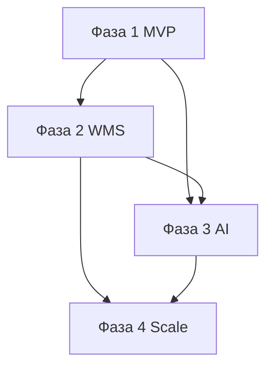

**Критический путь:** Catalog + Order + Billing (недели 2–8) блокируют все клиентские приложения. Picker и Courier можно разрабатывать параллельно после готовности Order API.

### 6.7. Риски roadmap и митигация

| Риск | Impact | Вероятность | Митигация |
|------|--------|-------------|-----------|
| Задержка Payme merchant approval | High | Medium | Параллельно Click; sandbox тесты с недели 4 |
| Нехватка senior Go-разработчиков | High | Medium | Remote contractors; упрощение scope |
| Проблемы с арендой даркстора | High | Low | Backup локация; гибкий layout |
| Перегрев серверов Uztelecom летом | Medium | Medium | Cooling audit; резервные ноды |
| Низкий adoption первый месяц | High | Medium | Агрессивный маркетинг; реферальная программа в soft launch |

### 6.8. Definition of Done (общий для всех фаз)

- Code review: минимум 1 approver
- Unit tests: coverage не снижается
- Integration tests: happy path + 1 error path
- API docs: OpenAPI обновлён
- Runbook: для новых интеграций
- Staging: 48 часов soak test без critical bugs
- Product sign-off: PM acceptance

---

## 7. Команда и бюджет

### 7.1. Состав команды (14 FTE на старте)

| # | Роль | Кол-во | $/мес | $/час (160h) | $/год |
|---|------|--------|-------|--------------|-------|
| 1 | Tech Lead / Архитектор | 1 | 4 500 | 28.1 | 54 000 |
| 2 | Senior Backend (Go) | 2 | 3 500 | 21.9 | 84 000 |
| 3 | Middle Backend (Go) | 1 | 2 000 | 12.5 | 24 000 |
| 4 | Senior Flutter | 1 | 3 000 | 18.8 | 36 000 |
| 5 | Senior Android (Kotlin) | 1 | 3 000 | 18.8 | 36 000 |
| 6 | Middle Android (Kotlin) | 1 | 2 000 | 12.5 | 24 000 |
| 7 | Senior Frontend (React) | 1 | 2 800 | 17.5 | 33 600 |
| 8 | Middle Frontend (React) | 1 | 2 000 | 12.5 | 24 000 |
| 9 | DevOps / SRE | 1 | 3 000 | 18.8 | 36 000 |
| 10 | QA Engineer | 1 | 2 000 | 12.5 | 24 000 |
| 11 | Product Manager | 1 | 3 000 | 18.8 | 36 000 |
| 12 | UI/UX Designer | 1 | 2 000 | 12.5 | 24 000 |
| 13 | Юрист (комплаенс) | 0.5 | 1 000 | — | 12 000 |
| 14 | Бухгалтер | 0.5 | 800 | — | 9 600 |
| | **ИТОГО** | **14** | **~38 100** | | **~457 200** |

*Зарплаты ориентированы на рынок Узбекистана с конкурентным уровнем для привлечения senior-специалистов; выплата возможна в UZS по курсу ЦБ.*

### 7.2. Бюджет MVP (4 месяца, фаза 1)

| Статья | USD | UZS (≈) | Примечание |
|--------|-----|---------|------------|
| Зарплаты (4 мес) | 152 400 | 1.9 млрд | 14 FTE |
| Инфраструктура (4 мес) | 12 000 | 150 млн | Uztelecom K8s, мониторинг |
| Даркстор (аренда 4 мес + оборудование) | 38 000 | 475 млн | 200 м², холодильники, стеллажи |
| Маркетинг (запуск) | 15 000 | 187.5 млн | Instagram, Telegram, инфлюенсеры |
| Лицензии и ПО | 3 000 | 37.5 млн | GitLab, Figma, 2ГИС API |
| Юридические услуги | 3 000 | 37.5 млн | Payme/Click договоры, ПДн |
| Резерв (10%) | 22 340 | 279 млн | |
| **ИТОГО MVP** | **~245 740** | **~3.07 млрд** | |

### 7.3. Бюджет 14 месяцев (полный roadmap)

| Статья | USD | % |
|--------|-----|---|
| Зарплаты | 457 200 | 66.8% |
| Инфраструктура | 36 000 | 5.3% |
| Даркстор (аренда + оборудование) | 60 000 | 8.8% |
| Маркетинг | 25 000 | 3.6% |
| Лицензии и ПО | 10 000 | 1.5% |
| Юридические услуги | 8 000 | 1.2% |
| Подряд (ML, Data Engineer) | 15 000 | 2.2% |
| Резерв (15%) | 89 000 | 13.0% |
| **ИТОГО** | **~700 200** | **100%** |

### 7.4. Даркстор Ташкент — детализация

| Статья | Стоимость |
|--------|-----------|
| Аренда 200 м² | 25 000 000 UZS/мес (~2 000 USD) |
| Холодильное оборудование | 15 000 USD |
| Стеллажи, зонирование A–F | 8 000 USD |
| Термосумки (50 шт.) + хладоэлементы | 2 000 USD |
| Сканеры штрихкодов (10 шт.) | 1 500 USD |
| Планшеты сборщиков (8 шт.) | 2 400 USD |
| Мопеды/велосипеды (12 шт.) | 6 000 USD |
| IoT-логгеры (фаза 2) | 1 500 USD |

### 7.5. Организационная структура

```
CEO
 └── Product Manager
      ├── Tech Lead
      │    ├── Backend Team (3)
      │    ├── Mobile Team (3: Flutter + 2 Android)
      │    ├── Frontend Team (2)
      │    ├── DevOps (1)
      │    └── QA (1)
      ├── UI/UX Designer (1)
      ├── Operations (директор даркстора — вне IT, фаза 1)
      ├── Юрист (0.5)
      └── Бухгалтер (0.5)
```

**Коммуникации:**

- Daily standup: 15 мин, команда разработки
- Sprint: 2 недели
- Demo: конец спринта, stakeholders
- Retro: после demo
- Операционный sync (после launch): PM + директор даркстора, ежедневно 09:00

### 7.6. Hiring plan

| Месяц | Роль | Приоритет |
|-------|------|-----------|
| 1 | Tech Lead, DevOps, Senior Backend ×2 | P0 |
| 1 | PM, Designer | P0 |
| 2 | Flutter, Senior Android, Frontend Senior | P0 |
| 2 | Middle Backend, QA | P1 |
| 3 | Middle Android, Frontend Middle | P1 |
| 4 | Юрист, Бухгалтер (подряд) | P1 |

### 7.7. Операционный бюджет (вне IT, ежемесячно после launch)

| Статья | UZS/мес | USD/мес (≈) |
|--------|---------|-------------|
| ФОТ сборщики (8) | 48 000 000 | 3 840 |
| ФОТ курьеры (12) | 60 000 000 | 4 800 |
| ФОТ директор даркстора | 15 000 000 | 1 200 |
| Расходники (пакеты, термо) | 3 000 000 | 240 |
| Топливо / обслуживание транспорта | 5 000 000 | 400 |
| **Итого OPEX ops** | **~131 000 000** | **~10 480** |

*Не включено в IT-бюджет 700k USD; финансируется из операционной выручки после launch.*

---

## 8. Чек-лист приёмки MVP

### 8.1. Функциональные требования

#### Клиентское приложение (Android)

- [ ] Регистрация/авторизация по телефону + OTP
- [ ] 4 языка интерфейса (uz кирилл., uz лат., ru, en)
- [ ] Каталог 3 900 SKU с фильтрами (халяль, цена, бренд)
- [ ] Поиск с автодополнением (Elasticsearch)
- [ ] Корзина: добавление, изменение количества, удаление
- [ ] Расчёт доставки в реальном времени (`POST /delivery/quote`)
- [ ] Оформление: адрес с махалля, ориентир, фото входа
- [ ] Оплата Payme и Click (переключение при ошибке)
- [ ] WebSocket трекинг: статусы, ETA, карта курьера
- [ ] Push-уведомления (статусы, замены)
- [ ] «Сообщить о проблеме» (без кнопки «Вернуть»)
- [ ] История заказов, повторить заказ, оценка
- [ ] Профиль: адреса, язык, поддержка

#### Приложение сборщика

- [ ] Получение задач, волновая сборка A→F
- [ ] Сканирование штрихкодов с валидацией
- [ ] Замена товара с таймером 60 сек клиенту
- [ ] Весовые товары: Bluetooth-весы, ±5%
- [ ] Упаковка: QR пакета, термосумка для заморозки
- [ ] Offline 30 мин: сканы, статусы в outbox
- [ ] Статистика сборщика

#### Приложение курьера

- [ ] Старт/стоп смены, online/offline
- [ ] Офферы с таймером 30 сек
- [ ] Мультизаказ до 2 заказов (detour ≤ 5 мин)
- [ ] Навигация 2ГИС/Яндекс + OSRM fallback
- [ ] Фото у двери + OTP/подпись при доставке
- [ ] **Без COD** — только предоплаченные заказы
- [ ] Offline 30 мин: статусы, фото в outbox
- [ ] Статистика заработка

#### Панель директора даркстора

- [ ] Real-time дашборд заказов
- [ ] Ручное назначение сборщика/курьера
- [ ] Управление остатками и ценами
- [ ] Импорт/экспорт Excel ассортимента
- [ ] Управление сменами персонала

#### Панель поддержки

- [ ] Очередь тикетов с SLA
- [ ] Чат с клиентом (WebSocket)
- [ ] Просмотр заказа и оплаты
- [ ] Одобрение/отклонение возврата → Billing

#### HQ-панель (базовая)

- [ ] GMV, заказы, OTD за период
- [ ] Экспорт CSV отчётов

#### Backend

- [ ] 8 микросервисов deployed в K8s
- [ ] Стейт-машина заказа: все переходы
- [ ] NATS события между сервисами
- [ ] Payme + Click webhooks с idempotency
- [ ] Фискализация 100% оплаченных заказов
- [ ] Антифрод rules (базовые)

### 8.2. Нефункциональные требования

| Метрика | Target | Метод проверки |
|---------|--------|----------------|
| RPS sustained | 200 | k6 load test, 10 мин |
| RPS peak | 500 | k6 spike test, 2 мин |
| WebSocket connections | 2 000 | concurrent WS test |
| Uptime | 99.5% | 30 дней production |
| API p99 latency | < 500 ms | Prometheus |
| API p50 latency | < 150 ms | Prometheus |
| Mobile cold start | < 3 сек | Manual / Firebase Perf |
| Backup restore | < 4 часа | Quarterly DR drill |
| Test coverage (backend) | ≥ 60% | go test -cover |
| Security scan | 0 critical | Trivy, gitleaks |

### 8.3. Комплаенс

| Требование | Статус MVP | Ответственный | Критерий |
|------------|------------|---------------|----------|
| Закон «О персональных данных» № ЗРУ-547 | Обязательно | Юрист | Согласие в приложении, политика конфиденциальности, хранение в UZ |
| Договор Payme merchant | Обязательно | Юрист + Finance | Подписан, prod credentials |
| Договор Click merchant | Обязательно | Юрист + Finance | Подписан, prod credentials |
| Регистрация ОФД / ККМ | Обязательно | Бухгалтер | 100% чеков в Soliq |
| PCI SAQ-A | Обязательно | Tech Lead | Не храним card data; redirect на Payme/Click |
| АСЛ БЕЛГИ | Roadmap фаза 2 | Operations | MVP: ручная верификация при приёмке |
| Халяль-сертификаты | Обязательно | Operations | Документы на все SKU мяса/молочки |
| Трудовые договоры курьеров/сборщиков | Обязательно | HR/Юрист | Штат или ГПХ по законодательству РУз |
| Лицензия на торговлю | Обязательно | Юрист | Актуальная лицензия на адрес даркстора |

### 8.4. Критерии sign-off

Документ считается принятым при:

1. **100%** пунктов раздела 8.1 (functional) — passed
2. **100%** метрик раздела 8.2 (non-functional) — passed
3. **100%** обязательных пунктов раздела 8.3 (compliance) — documented
4. Подписи: Product Manager, Tech Lead, QA Lead, CEO
5. Soft launch: 7 дней, 200+ заказов/день без critical incidents

### 8.5. Тестовые сценарии приёмки (E2E)

| # | Сценарий | Шаги | Expected |
|---|----------|------|----------|
| E2E-01 | Полный заказ | Каталог → корзина → Payme → трекинг → доставка | DELIVERED, чек в SMS |
| E2E-02 | Отмена до сборки | Оплата → отмена в приложении | Refund < 24ч, CANCELLED_BY_USER |
| E2E-03 | Замена товара | Сборщик → нет SKU → push → выбор | Новый SKU в заказе, корректная сумма |
| E2E-04 | Мультизаказ | 2 заказа READY → 1 курьер | Оба DELIVERED, detour ≤ 5 мин |
| E2E-05 | Возврат через поддержку | report-problem → оператор approve | Refund на карту, push клиенту |
| E2E-06 | Offline курьер | DELIVERED без сети → sync | Статус в Order, фото в MinIO |
| E2E-07 | Payme fail → Click | Payme timeout → auto Click | Оплата успешна через Click |
| E2E-08 | Сложная махалля | Адрес с is_complex | delivery_fee +3 000 UZS |
| E2E-09 | 4 языка | Смена языка → весь UI | Нет missing keys |
| E2E-10 | Антифрод block | 4 заказа/час 1 device | 4-й заказ flagged/blocked |

### 8.6. Матрица ответственности приёмки (RACI)

| Область | PM | Tech Lead | QA | DevOps | Operations |
|---------|----|-----------|----|--------|------------|
| Функциональность клиента | A | C | R | I | I |
| Backend API | C | A | R | C | I |
| Инфраструктура | I | A | C | R | I |
| Платежи | A | R | R | I | C |
| Операции даркстора | A | I | C | I | R |
| Комплаенс | A | C | I | I | C |
| Go-Live decision | A | R | R | R | R |

*R = Responsible, A = Accountable, C = Consulted, I = Informed*

### 8.7. Post-launch мониторинг (первые 30 дней)

| Метрика | Частота проверки | Порог эскалации |
|---------|------------------|-----------------|
| OTD | Каждый час | < 80% за час |
| Payment success rate | Каждые 15 мин | < 95% |
| API error rate | Real-time alert | > 1% |
| Pick SLA breach | Каждый час | > 15% |
| Support ticket backlog | Каждые 4 часа | > 20 open |
| App crash rate | Ежедневно | > 0.5% sessions |
| NPS (опрос in-app) | Еженедельно | < 20 |

---

## Приложения

### A. Глоссарий

| Термин | Определение |
|--------|-------------|
| Dark store | Склад без витрины, только для онлайн-заказов |
| OTD | On-Time Delivery — доставка в обещанный SLA |
| SKU | Stock Keeping Unit — единица товара |
| Махалля | Традиционный квартал в Узбекистане |
| АСЛ БЕЛГИ | Система маркировки товаров РУз |
| ККМ | Контрольно-кассовая машина |
| COD | Cash on Delivery — **не используется** в проекте |

### B. Ссылки

- Uztelecom Cloud: https://cloud.uztelecom.uz
- Payme Merchant API: https://developer.help.paycom.uz
- Click API: https://docs.click.uz
- Закон о ПДн РУз: https://lex.uz

### C. История изменений документа

| Версия | Дата | Автор | Изменения |
|--------|------|-------|-----------|
| 1.0 | 27.06.2026 | Jomboy Lavka Engineering | Первый полный выпуск ТЗ |

### D. Согласование

| Роль | ФИО | Подпись | Дата |
|------|-----|---------|------|
| CEO | | | |
| Product Manager | | | |
| Tech Lead | | | |
| Head of Operations | | | |

### E. Требования к качеству кода

| Параметр | Backend (Go) | Frontend (React) | Mobile (Flutter/Kotlin) |
|----------|--------------|------------------|-------------------------|
| Linter | golangci-lint | ESLint + Prettier | dart analyze / detekt |
| Formatter | gofmt | Prettier | dart format / ktlint |
| Min test coverage | 60% (MVP) | 50% | 40% |
| PR size | < 400 lines preferred | < 400 lines | < 500 lines |
| Review | 1 approval required | 1 approval | 1 approval |
| Branch strategy | GitFlow: main, develop, feature/* | same | same |
| Commit message | Conventional Commits | Conventional Commits | Conventional Commits |

**Запрещено в production:**

- Hardcoded secrets (gitleaks в CI)
- `panic()` в HTTP handlers без recovery
- Прямые SQL без prepared statements
- Логирование ПДн (телефон, адрес) в plain text
- COD / cash payment flows — не реализовывать

### F. Контакты и эскалация (шаблон)

| Уровень | Контакт | SLA ответа |
|---------|---------|------------|
| L1 Support | support@jomboy-lavka.uz | 15 мин |
| L2 Engineering on-call | oncall@jomboy-lavka.uz | 30 мин |
| L3 Tech Lead | — | 1 час |
| Critical incident | Telegram war-room | 15 мин |

**Классификация инцидентов:**

| Severity | Описание | Пример |
|----------|----------|--------|
| SEV-1 | Сервис недоступен | API down, платежи не работают |
| SEV-2 | Деградация | p99 > 2s, 10% payment failures |
| SEV-3 | Minor | UI bug, некритичный отчёт |
| SEV-4 | Cosmetic | Опечатка в переводе |

### G. Реестр открытых решений (ADR summary)

| # | Решение | Обоснование | Альтернатива (отклонена) |
|---|---------|-------------|-------------------------|
| ADR-01 | Go 1.22 для backend | Производительность, hiring в UZ | Elixir (дефицит кадров) |
| ADR-02 | 8 микросервисов на MVP | Баланс сложности и масштаба | 16 сервисов (over-engineering) |
| ADR-03 | Android-only клиент на MVP | Скорость launch, 95% рынка UZ mobile | iOS одновременно |
| ADR-04 | Только онлайн-оплата | Скорость, антифрод, UX | COD (медленнее, фрод) |
| ADR-05 | Uztelecom Cloud | Data residency РУз | AWS/GCP (compliance risk) |
| ADR-06 | Возвраты через Support | Контроль фрода, качество сервиса | Self-service return button |
| ADR-07 | NATS JetStream | Легковесность, persistence | Kafka (overkill для MVP) |
| ADR-08 | Flutter для клиента | iOS-ready codebase, один team | Native Swift + Kotlin |

*Данный документ является единым источником правды (Single Source of Truth) для проекта Jomboy Lavka Uzbekistan v1.0. Все изменения scope, сроков и бюджета оформляются через change request с обновлением версии ТЗ и повторным согласованием заинтересованных сторон. Связанные артефакты: OpenAPI specs в репозитории `jomboy-api`, дизайн-макеты в Figma, runbooks в `jomboy-k8s-manifests/docs`.*

---

**Конец документа.**

